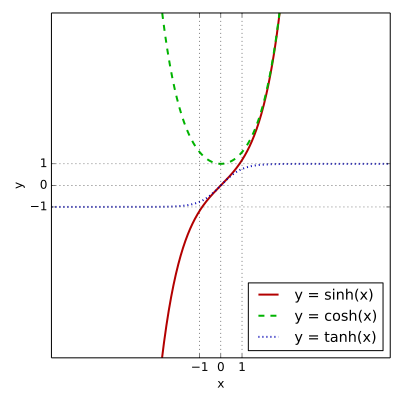

# Complex Numbers

## Cartesian Form

$$
z = x + iy
\quad
\bar z = x - iy
$$

$$
\Re z = x = \frac{1}{2} (z + \bar z)
\quad
\Im z = y = \frac{1}{2i} (z - \bar z)
$$

$$
\overline{\parens{z_1 + z_2}} = \bar z_1 + \bar z_2
\quad 
\overline{\parens{z_1 - z_2}} = \bar z_1 - \bar z_2
$$

$$
\overline{\parens{z_1 z_2}} = \bar z_1 \bar z_2 
\quad
\overline{\parens{\frac{z_1}{z_2}}} = \frac{\bar z_1}{\bar z_2}
$$

## Polar Form

$$
x = r \cos \theta
\quad
y = r \sin \theta
\quad
z = r(\cos \theta + i \sin \theta)
$$

$$\abs{z} = r = \sqrt{x^2 + y^2} = \sqrt{z \bar z}$$

$$
\arg z = \theta
\quad
-\pi < \Arg z \leq \pi
$$

$$\tan \theta = \frac{y}{x}$$

$$
\begin{aligned}
z_1 z_2
&= r_1 r_2 \brackets{
    \cos(\theta_1 + \theta_2)
    + i \sin (\theta_1 + \theta_2)
} \\
\frac{z_1}{z_2}
&= \frac{r_1}{r_2} \brackets{
    \cos(\theta_1 + \theta_2)
    + i \sin (\theta_1 + \theta_2)
} \\
\end{aligned}
$$

$$
\abs{z_1 z_2}
= \abs{z_1} \abs{z_2}
= r_1 r_2
\quad
\abs{\frac{z_1}{z_2}}
= \frac{\abs{z_1}}{\abs{z_2}}
= \frac{r_1}{r_2}
$$

$$
\begin{aligned}
\arg (z_1 z_2)
&= \arg z_1 + \arg z_2 \\
\arg \frac{z_1}{z_2}
&= \arg z_1 - \arg z_2 \\
\end{aligned}
\quad
\text{up to multiples of } 2\pi
$$

$$
z^n
= r^n \parens{\cos n \theta + i \sin n \theta}
$$

$$
\sqrt[n]{z}
= \sqrt[n]{r} \parens{\cos \frac{\theta + 2k\pi}{n} + i \sin \frac{\theta + 2k\pi}{n}}
$$

# Graphing

Circle with radius $R$ and center $z_0$: $$\abs{z - z_0} = R$$

Disc with radius $R$ and center $z_0$: $$\abs{z - z_0} < R$$

Annulus with outer radius $R$, inner radius $r$, and center $z_0$: $$r < \abs{z - z_0} < R$$

Wedge between $-\theta$ and $\theta$: $$\abs{\arg z} < \theta$$

Half plane bounded at $z = a$: $$\Re z \ge -1$$

# Analytic Functions

Functions that are differentiable in *some* domain. Functions are considered **entire** if differentiable *everywhere*.

## Test via Cauchy-Riemann Equations

$$f(x) = u(x,y) + i v(x,y) = u(r, \theta) + i v(r, \theta)$$

$$
u_x = v_y 
\quad
\text{and} 
\quad
u_y = -v_x
$$

$$
u_r = \frac{1}{r} v_\theta 
\quad
\text{and} 
\quad
v_r = -\frac{1}{r} u_\theta
$$

## Harmonic Functions

$$\laplacian u = 0$$

Use Cauchy-Riemann Equations to calculate a harmonic conjugate function $v$ and find $f(z)$. 

# Derivatives

$$f'(z) = u_x + i v_x = v_y - iu_y$$

# Exponential

$$
e^z
= e^x e^{iy}
= e^x \parens{\cos y + i \sin y}
$$

$$
\abs{e^z} = e^x
$$

## Solving for z

$$
e^z 
= e^x \parens{\cos y + i \sin y}
= a + i b
$$

$$
\abs{e^z}
= e^x
= \sqrt{a^2 + b^2}
\implies
x = \ln \sqrt{a^2 + b^2}
$$

$$
y 
= \arg (a + i b) 
= \tan^{-1} \parens{\frac{b}{a}} + 2n\pi, \quad (n \in \mathbb{Z}) 
$$

# Trigonometry

$$
\cos z = \frac{1}{2} \parens{e^{iz} + e^{-iz}}
\quad
\sin z = \frac{1}{2i} \parens{e^{iz} - e^{-iz}}
$$

$$
\cosh z = \frac{1}{2} \parens{e^{z} + e^{-z}}
\quad
\sinh z = \frac{1}{2i} \parens{e^{z} - e^{-z}}
$$

$$
\begin{array}{ll}
\cos iz = \cosh z & \sin iz = -i \sinh z \\
\cosh iz = \cos z & \sinh iz = -i \sin z \\
\end{array}
$$

$$
\begin{aligned}
\cos z &= \cos x \cosh y - i \sin x \sinh y \\
\sin z &= \sin x \cosh y + i \cos x \sinh y
\end{aligned}
$$

$$
\begin{aligned}
\abs{\cos z}^2 &= \cos^2 x + \sinh^2 y \\
\abs{\sin z}^2 &= \sin^2 x + \sinh^2 y
\end{aligned}
$$

## Identities

$\sin^2 \theta = \frac{1}{2} - \frac{1}{2}\cos 2\theta$

$\cos^2 \theta = \frac{1}{2} + \frac{1}{2}\cos 2\theta$

$\sin \theta \cos \theta = \frac{1}{2} \sin 2\theta$

$\sin(\alpha + \beta) = \sin \alpha \cos \beta + \cos \alpha \sin \beta$

$\sin(\alpha - \beta) = \sin \alpha \cos \beta - \cos \alpha \sin \beta$

$\cos(\alpha + \beta) = \cos \alpha \cos \beta - \sin \alpha \sin \beta$

$\cos(\alpha - \beta) = \cos \alpha \cos \beta + \sin \alpha \sin \beta$

$\cosh^2 x - \sinh^2 x = 1$

$\cosh (x + y) = \cosh x \cosh y + \sinh x \sinh y$

$\sinh (x + y) = \sinh x \cosh y + \cosh x \sinh y$

## Values

{width=2.5in}

$$
\begin{array}{|c|ccccc|}
  \hline
	& 0 & \pi/6 & \pi/4 & \pi / 3 & \pi / 2 \\
  \hline
	\sin \theta & 0 & 1/2 & \sqrt{2} / 2 & \sqrt{3} / 2 & 1 \\
	\cos \theta & 1 & \sqrt{3} / 2 & \sqrt{2} / 2 & 1 / 2 & 0 \\
	\tan \theta & 0 & 1 / \sqrt{3} & 1 & \sqrt{3} & - \\
	\sinh & 0 &&&& \\
	\cosh & 1 &&&& \\
	\tanh & 0 &&&& \\
  \hline
\end{array}
$$

# Logarithm

$$
\Ln z 
= \ln \abs{z} + i \Arg z
$$

$$
\ln z 
= \ln r + i \theta 
= \Ln z + 2 n \pi i, \quad (n \in \mathbb{Z})
$$

$$
z^c
= e^{c \ln z}
\quad
a^z
= e^{z \ln a}
$$

# Line Integrals

## Analytic Functions

$$
\int_C f(z) \ dz
= \int_{z_0}^{z_1} f(z) \ dz
= F(z_1) - F(z_0)
$$

## General

#. Represent the path $C$ in the form $z(t) (t \in [a,b])$
#. Calculate the derivative $\dot z(t)$
#. Substitute $z(t)$ into $f(z)$
#. Integrate

$$
\int_C f(z) \ dz
= \int_a^b f(z(t)) \dot z(t) \ dt
$$

# Loop Integrals

$$
\oint_C (z - z_0)^m \ dz
= \begin{cases}
2 \pi i & (m = -1) \\
0 & (m \neq -1, \ m \in \mathbb{Z})
\end{cases}
$$

## Analytic Functions $f(z)$

### Cauchy's Integral Theorem

$$
\oint_C f(z) \ dz = 0
$$

### Cauchy's Integral Formula

$$
\oint_C \frac{f(z)}{z - z_0} \ dz
= 2 \pi i f(z_0)
$$

$$
f(z_0) 
= \frac{1}{2 \pi i} \oint_C \frac{f(z)}{z - z_0} \ dz 
$$

$$
f^{(n)}(z_0) 
= \frac{n!}{2 \pi i} \oint_C \frac{f(z)}{(z - z_0)^{n+1}} \ dz
\quad (n \in \mathbb{Z}^+)
$$

# Series Convergence

## Tests

### Comparison

If $\abs{z_i} <= b_i \forall i$ and the $b$-series converges, the $z$ series converges absolutely.

### Geometric Series

$$
\infsum q^m
= \begin{cases}
\frac{1}{1-q} & \abs{q} < 1 \\
\text{diverges} & \abs{q} \geq 1
\end{cases}
$$

### Ratio Test & Root Test

$$
\inflim \abs{\frac{z_{n+1}}{z_n}} = L
\quad
\inflim \abs{\sqrt[n]{z_n}} = L
$$

- $L < 1 \implies$ converges absolutely
- $L = 1 \implies$ inconclusive
- $L > 1 \implies$ diverges

## Radius of Convergence

$$\abs{z - z_0} < R = \frac{1}{L}$$
