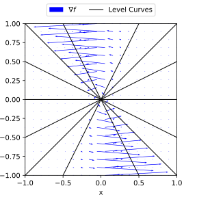
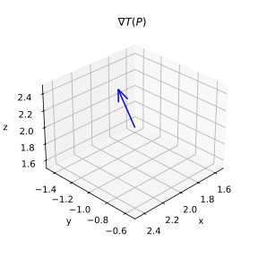

# Problem 9.7.3.
Find $\grad f$. Graph some level curves $f = \text{const}$. Indicate $\grad f$ by arrows at some points of these curves.

$$f = \frac{y}{x}$$

## Solution.

$$\grad f = [f_x, f_y]$$
$$\boxed{\grad f = \brack{-\frac{y}{x^2}, \frac{1}{x}}}$$

Level Surfaces:
$$f(x,y) = \frac{y}{x} = c$$
$$\boxed{y = cx}$$

{width=3.5in}\ 

# Problem 9.7.8.
Prove and illustrate by an example

$$\grad (fg) = f \grad g + g \grad f$$

## Proof.

$$\grad (fg) = \brack{\pder{x_1}(fg),\dots, \pder{x_n}(fg)}$$

The $i$-th component can be expanded by chain rule,
$$\pder{x_i}(fg) = f\pder[g]{x_i} + g\pder[f]{x_i}$$

Therefore in general,
$$
\begin{aligned}
\grad (fg) &= \brack{\pder{x_1}(fg),\dots, \pder{x_n}(fg)} \\
&= f \brack{\pder[g]{x_1}, \dots, \pder[g]{x_n}} + 
    g \brack{\pder[f]{x_1}, \dots, \pder[f]{x_n}} \\
&= \boxed{f \grad g + g \grad f}
\end{aligned}
$$

## Example.

$$\grad (xy) = x \grad y + y \grad x$$

$$\grad (xy) = x \brack{0, 1} + y \brack{1, 0} = [y, x]$$

# Problem 9.7.21.
Given the velocity potential $f$ of a flow, find the velocity $\mathbf{v} = \grad f$ of the field and its value $\mathbf{v}(P)$ at $P$. Sketch $\mathbf{v}(P)$ and the curve $f = \text{const}$ passing through $P$

$$f = e^x \cos y, \quad P:(1,1)$$

## Solution.

$$
\begin{aligned}
\mathbf{v} &= \grad (e^x \cos y) \\
&= \boxed{[e^x \cos y, -e^x \sin y]}
\end{aligned}
$$

$$\boxed{\mathbf{v}(P) = [e \cos 1, -e \sin 1]}$$

# Problem 9.7.26.
Experiments show that in a temperature field, heat flows in the direction of maximum decrease of temperature $T$. Find this direction in general and at the given point $P$. Sketch that direction at $P$ as an arrow.

$$T = x^2 + y^2 + 4z^2, \quad P:(2,-1,2)$$

## Solution.

$$
\boxed{\grad T = [2x, 2y, 8z]}
$$

$$
\boxed{\grad T(P) = [4, -2, 16]}
$$

{width=3.5in}\ 

# Problem 9.8.3.
Find $\diverg \mathbf{v}$ and its value at $P$:

$$\mathbf{v} = (x^2 + y^2)^{-1}[x,y]$$

## Solution.

$$\mathbf{v} = \brack{\frac{x}{x^2 + y^2}, \frac{y}{x^2 + y^2}}$$

$$
\begin{aligned}
\diverg \mathbf{v} &= 
    \pder{x} \paren{\frac{x}{x^2 + y^2}} + 
    \pder{y} \paren{\frac{y}{x^2 + y^2}} \\
&= \frac{y^2 - x^2}{(x^2 + y^2)^2} + \frac{x^2 - y^2}{(x^2 + y^2)^2} \\
&= \boxed{0}
\end{aligned}
$$

# Problem 9.8.5. 
Find $\diverg \mathbf{v}$ and its value at $P$:

$$\mathbf{v} = x^2 y^2 z^2 [x,y,z], \quad P:(3, -1, 4)$$

## Solution.

$$\mathbf{v} = \brack{x^3 y^2 z^2, x^2 y^3 z^2, x^2 y^2 z^3}$$

$$
\begin{aligned}
\diverg \mathbf{v} &= 
    \pder{x} (x^3 y^2 z^2) + 
    \pder{y} (x^2 y^3 z^2) + 
    \pder{z} (x^2 y^2 z^3) \\
&= \boxed{9 x^2 y^2 z^2}
\end{aligned}
$$

$$
\boxed{\diverg \mathbf{v(P)} = 1296}
$$

# Problem 9.8.9. PROJECT. Useful Formulas for the Divergence.

## Part a. 
### Prove $\diverg (k \mathbf{v}) = k \diverg \mathbf{v}, \quad (k \text{ constant})$

$$k \mathbf{v} = [kv_1, \dots, kv_n]$$

$$
\begin{aligned}
\diverg (k \mathbf{v}) &= \pder{x_1} (kv_1) + \dots + \pder{x_n} (kv_n) \\
&= k\paren{\pder[v_1]{x_1} + \dots + \pder[v_n]{x_n}} \\
&= \boxed{k \diverg \mathbf{v}}
\end{aligned}
$$

## Part b.
### Prove $\diverg (f \mathbf{v}) = f (\diverg \mathbf{v}) + \mathbf{v} \cdot \grad f$

$$f \mathbf{v} = [fv_1, \dots, fv_n]$$

$$\diverg (f \mathbf{v}) = \pder{x_1} (f v_1) + \dots + \pder{x_n} (f v_n)$$

The $i$-th component can be expanded by chain rule,
$$\pder{x_i}(f v_i) = f \pder[v_i]{x_i} + \pder[f]{x_i} v_i$$

Therefore in general,
$$
\begin{aligned}
\diverg (f \mathbf{v}) &= \pder{x_1}(f v_1) + \dots + \pder{x_n}(f v_n) \\
&= f \paren{\pder[v_1]{x_1} + \dots + \pder[v_n]{x_n}} + 
    \paren{v_1 \pder[f]{x_1} + \dots + v_n \pder[f]{x_n}} \\
&= f \paren{\pder[v_1]{x_1} + \dots + \pder[v_n]{x_n}} + 
    \mathbf{v} \cdot \brack{\pder[f]{x_1}, \dots, \pder[f]{x_n}} \\
&= \boxed{f \diverg \mathbf{v} + \mathbf{v} \cdot \grad f}
\end{aligned}
$$

### Verify for $f = e^{xyz}$ and $\mathbf{v} = ax\mathbf{i} + by\mathbf{j} + cz\mathbf{k}$. 

$$
\begin{aligned}
\diverg (f \mathbf{v}) &= \diverg \brack{axe^{xyz}, bye^{xyz}, cze^{xyz}} \\
&= \paren{ae^{xyz} + axyze^{xyz}} +
    \paren{be^{xyz} + bxyze^{xyz}} + 
    \paren{ce^{xyz} + cxyze^{xyz}} \\
&= \boxed{(a + b + c) e^{xyz} + (a + b + c) xyz e^{xyz}}
\end{aligned}
$$

$$
\begin{aligned}
\diverg (f \mathbf{v}) &= e^{xyz} \diverg \brack{ax, by, cz} + \brack{ax, by, cz} \cdot \grad e^{xyz} \\
&= (a + b + c) e^{xyz} + \brack{ax, by, cz} \cdot \brack{yze^{xyz}, xze^{xyz}, xye^{xyz}} \\
&= \boxed{(a + b + c) e^{xyz} + (a + b + c) xyz e^{xyz}}
\end{aligned}
$$

### Obtain the answer to Prob. 6. 
*Find $\diverg (x^2 + y^2 + z^2)^{-3/2} [x, y, z]$.*

$$
\begin{array}{lrl}
\mathbf{v} = [x, y, z], & \diverg \mathbf{v} &= \diverg [x, y, z] \\
&&= 3 \\
f = (x^2 + y^2 + z^2)^{-3/2}, & \grad f &= \grad (x^2 + y^2 + z^2)^{-3/2} \\
&&= -3(x^2 + y^2 + z^2)^{-5/2} [x, y, z]
\end{array}
$$

$$
\begin{aligned}
\diverg (f \mathbf{v}) &= f \diverg \mathbf{v} + 
    \mathbf{v} \cdot \grad f \\
&= (x^2 + y^2 + z^2)^{-3/2} \cdot 3 + 
    [x, y, z] \cdot -3(x^2 + y^2 + z^2)^{-5/2} [x, y, z] \\
&= \boxed{0}
\end{aligned}
$$

## Part c.
### Prove $\diverg (f \grad g) = f \laplacian g + \grad f \cdot \grad g$

$$f \grad g = \brack{f \pder[g]{x_1}, \dots, f \pder[g]{x_n}}$$
$$\diverg (f \grad g) = \pder{x_1} \paren{f \pder[g]{x_1}} + 
    \dots + \pder{x_n} \paren{f \pder[g]{x_n}}$$
    
The $i$-th component can be expanded by chain rule,
$$\pder{x_i} \paren{f \pder[g]{x_i}} =  f \pdder[g]{x_i} + \pder[f]{x_i} \pder[g]{x_i}$$

Therefore in general,
$$
\begin{aligned}
\diverg (f \grad g) &= \pder{x_1} \paren{f \pder[g]{x_1}} + 
    \dots + \pder{x_n} \paren{f \pder[g]{x_n}} \\
&= f \paren{\pdder[g]{x_1} + \cdots + \pdder[g]{x_n}} + \brack{\pder[f]{x_1}, \dots, \pder[f]{x_n}} \cdot \brack{\pder[g]{x_1}, \dots, \pder[g]{x_n}} \\
&= \boxed{f \laplacian g + \grad f \cdot \grad g}
\end{aligned}
$$

### Verify for $f = x^2 - y^2$ and $g = e^{x+y}$.
$$
\begin{array}{c|cc}
& \grad & \laplacian \\
\hline
f & [2x, -2y] \\
g & [e^{x+y}, e^{x+y}] & [e^{x+y}, e^{x+y}] \\
\end{array}
$$

$$
\begin{aligned}
\diverg (f \grad g) &= \diverg \paren{(x^2 - y^2)\brack{e^{x+y}, e^{x+y}}} \\
&= \diverg \brack{x^2 e^{x+y} - y^2 e^{x+y}, x^2 e^{x+y} - y^2 e^{x+y}} \\
&= (2x + x^2 - y^2)e^{x+y} + (x^2 - 2y - y^2)e^{x+y} \\
&= \boxed{2(x + x^2 - y - y^2)e^{x+y}} \\
\end{aligned}
$$

$$
\begin{aligned}
\diverg (f \grad g) &= f \laplacian g + \grad f \cdot \grad g \\
&= (x^2 - y^2) [e^{x+y}, e^{x+y}] + [2x, -2y] \cdot [e^{x+y}, e^{x+y}] \\
&= \boxed{2(x + x^2 - y - y^2)e^{x+y}} \\
\end{aligned}
$$

## Part d.
### Prove $\diverg (f \grad g) - \diverg (g \grad f) = f \laplacian g - g \laplacian f$

From **Part c**,
$$
\diverg (f \grad g) - \diverg (g \grad f) =
    \paren{f \laplacian g + \grad f \cdot \grad g} - 
    \paren{g \laplacian f + \grad g \cdot \grad f}
$$

Therefore,
$$\diverg (f \grad g) - \diverg (g \grad f) = f \laplacian g - g \laplacian f$$

# Problem 9.8.17. 
Calculate $\laplacian f$ by Eq. (3). Check by direct differentiation. Indicate when (3) is simpler. Show the details of your work.

Eq. (3): $$\diverg (\grad f) = \laplacian f$$

$$f = \ln (x^2 + y^2)$$

## Solution.

$$
\begin{aligned}
\laplacian f &= \diverg (\grad f) \\
&= \diverg \left[\frac{2x}{x^2 + y^2}, \frac{2y}{x^2 + y^2}\right] \\
&= \frac{2(x^2 + y^2) - 4x^2}{(x^2 + y^2)^2} + \frac{2(x^2 + y^2) - 4y^2}{(x^2 + y^2)^2} \\
&= \frac{4(x^2 + y^2) - 4(x^2 + y^2)}{(x^2 + y^2)^2} \\
&= \boxed{0}
\end{aligned}
$$

$$
\begin{aligned}
\laplacian f &= f_{xx} + f_{yy} \\
&= \frac{2(x^2 + y^2) - 4x^2}{(x^2 + y^2)^2} + \frac{2(x^2 + y^2) - 4y^2}{(x^2 + y^2)^2} \\
&= \frac{4(x^2 + y^2) - 4(x^2 + y^2)}{(x^2 + y^2)^2} \\
&= \boxed{0}
\end{aligned}
$$

# Problem 9.9.4.
Find $\curl \mathbf{v}$ for $\mathbf{v}$ given with respect to right-handed Cartesian coordinates. Show the details of your work.

$$\mathbf{v} = [2y^2, 5x, 0]$$

## Solution.

$$
\begin{aligned}
\curl \mathbf{v} &= \left| \begin{matrix}
\hat{i} & \hat{j} & \hat{k} \\
\pder{x} & \pder{y} & \pder{z} \\
2y^2 & 5x & 0
\end{matrix} \right| \\
&= \hat{i} \paren{\pder{y}(0) - \pder{z}(5x)} - 
    \hat{j} \paren{\pder{x}(0) - \pder{z}(2y^2)} + 
    \hat{k} \paren{\pder{x}(5x) - \pder{y}(2y^2)} \\
&= \hat{k} (5 - 4y) \\
&= \boxed{[0, 0, 5 - 4y]}
\end{aligned}
$$

# Problem 9.9.9. 
Let $\mathbf{v}$ be the velocity vector of a steady fluid flow. 

$$\mathbf{v} = [0, 3z^2, 0]$$

## Is the flow irrotational? 

$$
\begin{aligned}
\curl \mathbf{v} &= \left| \begin{matrix}
\hat{i} & \hat{j} & \hat{k} \\
\pder{x} & \pder{y} & \pder{z} \\
0 & 3z^2 & 0
\end{matrix} \right| \\
&= \hat{i} \paren{\pder{y}(0) - \pder{z}(3z^2)} - 
    \hat{j} \paren{\pder{x}(0) - \pder{z}(0)} + 
    \hat{k} \paren{\pder{x}(3z^2) - \pder{y}(0)} \\
&= \hat{i} (-6z) \\
&= \boxed{[-6z, 0, 0]}
\end{aligned}
$$

$\curl \mathbf{v} \neq 0$ therefore the flow is **rotational**.

## Is the flow incompressible? 

$$\diverg \mathbf{v} = \pder{x}(0) + \pder{y}(3z^2) + \pder{z}(0) = \boxed{0}$$

$\diverg \mathbf{v} = 0$ therefore the flow is **incompressible**.

## Find the streamlines (the paths of the particles).

$$\mathbf{v} = \mathbf{r'} = [x', y', z']$$

$$
\begin{cases}
x' = 0 \\
y' = 3z^2 \\
z' = 0
\end{cases}
$$

Integrating, we get:

$$
\begin{cases}
x = x_0 \\
y = y_0 + 3z_0^2 t \\
z = z_0
\end{cases}
$$

Streamlines are in the form $\boxed{\mathbf{r}(t) = [x_0, y_0 + 3z_0^2 t, z_0]}$.

# Problem 9.9.14. PROJECT. Useful Formulas for the Curl. 
Assuming sufficient differentiability, show that

## Part a. 
$\curl (\mathbf{u} + \mathbf{v}) = \curl \mathbf{u} + \curl \mathbf{v}$

### Solution.
For 3D vectors $\mathbf{u}$ and $\mathbf{v}$,

$$\mathbf{u} + \mathbf{v} = [u_x + v_x, u_y + v_y, u_z + v_z]$$
$$
\begin{aligned}
\curl \mathbf{v} &= \left| \begin{matrix}
\hat{i} & \hat{j} & \hat{k} \\
\pder{x} & \pder{y} & \pder{z} \\
u_x + v_x & u_y + v_y & u_z + v_z
\end{matrix} \right| \\
&= \hat{i} \paren{\pder{y}(u_z + v_z) - \pder{z}(u_y + v_y)} - 
    \hat{j} \paren{\pder{x}(u_z + v_z) - \pder{z}(u_x + v_x)} + 
    \hat{k} \paren{\pder{x}(u_y + v_y) - \pder{y}(u_x + v_x)} \\
&= \brack{
    \paren{\pder{y}(u_z + v_z) - \pder{z}(u_y + v_y)}, 
    \paren{\pder{z}(u_x + v_x) - \pder{x}(u_z + v_z)},
    \paren{\pder{x}(u_y + v_y) - \pder{y}(u_x + v_x)}
    } \\
&= \brack{
    \paren{\pder[u_z]{y} + \pder[v_z]{y} - \pder[u_y]{z} - \pder[v_y]{z}}, 
    \paren{\pder[u_x]{z} + \pder[v_x]{z} - \pder[u_z]{x} - \pder[v_z]{x}},
    \paren{\pder[u_y]{x} + \pder[v_y]{x} - \pder[u_x]{y} - \pder[v_x]{y}}
    } \\
&= \brack{
    \paren{\pder[u_z]{y} - \pder[u_y]{z}},
    \paren{\pder[u_x]{z} - \pder[u_z]{x}},
    \paren{\pder[u_y]{x} - \pder[u_x]{y}}
    } + \brack{
    \paren{\pder[v_z]{y} - \pder[v_y]{z}},
    \paren{\pder[v_x]{z} - \pder[v_z]{x}},
    \paren{\pder[v_y]{x} - \pder[v_x]{y}}
    }\\
&= \boxed{\curl \mathbf{u} + \curl \mathbf{v}}
\end{aligned}
$$

## Part b 
$\diverg (\curl \mathbf{v}) = 0$

### Solution.

For 3D vector $\mathbf{v}$,

$$
\begin{aligned}
\curl \mathbf{v} &= \left| \begin{matrix}
\hat{i} & \hat{j} & \hat{k} \\
\pder{x} & \pder{y} & \pder{z} \\
v_x & v_y & v_z
\end{matrix} \right| \\
&= \hat{i} \paren{\pder[v_z]{y} - \pder[v_y]{z}} - 
    \hat{j} \paren{\pder[v_z]{x} - \pder[v_x]{z}} + 
    \hat{k} \paren{\pder[v_y]{x} - \pder[v_x]{y}} \\
&= \brack{
    \paren{\pder[v_z]{y} - \pder[v_y]{z}}, 
    \paren{\pder[v_x]{z} - \pder[v_z]{x}}, 
    \paren{\pder[v_y]{x} - \pder[v_x]{y}}
    }
\end{aligned}
$$

$$
\begin{aligned}
\diverg (\curl \mathbf{v}) &= \diverg \brack{
    \paren{\pder[v_z]{y} - \pder[v_y]{z}},
    \paren{\pder[v_x]{z} - \pder[v_z]{x}},
    \paren{\pder[v_y]{x} - \pder[v_x]{y}}
    } \\
&= \pder{x} \paren{\pder[v_z]{y} - \pder[v_y]{z}} + 
    \pder{y} \paren{\pder[v_z]{x} - \pder[v_x]{z}} + 
    \pder{z} \paren{\pder[v_y]{x} - \pder[v_x]{y}} \\
&= \frac{\partial^2 v_z}{\partial x \partial y} - \frac{\partial^2 v_y}{\partial x \partial z} + 
\frac{\partial^2 v_x}{\partial y \partial z} - \frac{\partial^2 v_z}{\partial x \partial y} +
\frac{\partial^2 v_y}{\partial x \partial z} - \frac{\partial^2 v_x}{\partial y \partial z} \\
&= \boxed{0}
\end{aligned}
$$

## Part c 
$\curl (f \mathbf{v}) = (\grad f) \times \mathbf{v} + f \curl \mathbf{v}$

### Solution.

For 3D vector $\mathbf{v}$,

$$
\begin{aligned}
\curl \mathbf{v} &= \left| \begin{matrix}
\hat{i} & \hat{j} & \hat{k} \\
\pder{x} & \pder{y} & \pder{z} \\
fv_x & fv_y & fv_z
\end{matrix} \right| \\
&= \hat{i} \paren{\pder{y}(fv_z) - \pder{z}(fv_y)} - 
    \hat{j} \paren{\pder{z}(fv_x) - \pder{x}(fv_z)} + 
    \hat{k} \paren{\pder{y}(fv_x) - \pder{x}(fv_y)} \\
&= \brack{
    \paren{\pder{y}(fv_z) - \pder{z}(fv_y)}, 
    \paren{\pder{x}(fv_z) - \pder{z}(fv_x)}, 
    \paren{\pder{y}(fv_x) - \pder{x}(fv_y)}
    }
\end{aligned}
$$

Expanding with chain rule,

$$
\begin{aligned}
&= \brack{
    \paren{f \pder[v_z]{y} + v_z \pder[f]{y} - f \pder[v_y]{z} - v_y \pder[f]{z}}, 
    \paren{f \pder[v_z]{x} - v_z \pder[f]{x} - f \pder[v_x]{z} + v_x \pder[f]{z}},
    \paren{f \pder[v_y]{x} + v_y \pder[f]{x} - f \pder[v_x]{y} - v_x \pder[f]{y}}
    } \\
&= \brack{
    \paren{v_z \pder[f]{y} - v_y \pder[f]{z}}, 
    \paren{v_x \pder[f]{z} - v_z \pder[f]{x}},
    \paren{v_y \pder[f]{x} - v_x \pder[f]{y}}
    } + \brack{
    f \paren{\pder[v_z]{y} - \pder[v_y]{z}}, 
    f \paren{\pder[v_z]{x} - \pder[v_x]{z}},
    f \paren{\pder[v_y]{x} - \pder[v_x]{y}}
    } \\
&= \boxed{(\grad f) \times \mathbf{v} + f \curl \mathbf{v}}
\end{aligned}
$$

## Part d 
$\curl (\grad f) = \mathbf{0}$

### Solution.

For $f(x,y,z)$,

$$
\begin{aligned}
\curl (\grad f) &= \curl \brack{\pder[f]{x}, \pder[f]{y}, \pder[f]{z}} \\
&= \brack{
    \paren{\pder{y}\paren{\pder[f]{z}} - \pder{z}\paren{\pder[f]{y}}}, 
    \paren{\pder{z}\paren{\pder[f]{x}} - \pder{x}\paren{\pder[f]{z}}},
    \paren{\pder{x}\paren{\pder[f]{y}} - \pder{y}\paren{\pder[f]{x}}}
    } \\
&= \brack{0, 0, 0} \\
&= \boxed{\mathbf{0}}
\end{aligned}
$$

## Part e 
$\diverg (\mathbf{u} \times \mathbf{v}) = \mathbf{v} \cdot \curl \mathbf{u} - \mathbf{u} \cdot \curl \mathbf{v}$

### Solution.

For 3D vectors $\mathbf{u}$ and $\mathbf{v}$,

$$
(\mathbf{u} \times \mathbf{v}) = \brack{
    \paren{u_y v_z - u_z v_y}, 
    \paren{u_z v_x - u_x v_z}, 
    \paren{u_x v_y - u_y v_x}
    } 
$$

$$
\begin{aligned}
\diverg (\mathbf{u} \times \mathbf{v}) &= \diverg \brack{
    \paren{u_y v_z - u_z v_y}, 
    \paren{u_z v_x - u_x v_z}, 
    \paren{u_x v_y - u_y v_x}
    } \\
&= \pder{x} \paren{u_y v_z - u_z v_y} + \pder{y} \paren{u_z v_x - u_x v_z} + \pder{z} \paren{u_x v_y - u_y v_x} \\
&= \paren{v_z \pder[u_y]{x} - v_y \pder[u_z]{x}} + 
    \paren{v_x \pder[u_z]{y} - v_z \pder[u_x]{y}} + 
    \paren{v_y \pder[u_x]{z} - v_x \pder[u_y]{z}} + \\
    &\quad \paren{u_y \pder[v_z]{x} - u_z \pder[v_y]{x}} + 
    \paren{u_z \pder[v_x]{y} - u_x \pder[v_z]{y}} + 
    \paren{u_x \pder[v_y]{z} - u_y \pder[v_x]{z}} \\
&= v_x \paren{\pder[u_z]{y} - \pder[u_y]{z}} + 
    v_y \paren{\pder[u_x]{z} - \pder[u_z]{x}} + 
    v_z \paren{\pder[u_y]{x} - \pder[u_x]{y}} + \\
    &\quad u_x \paren{\pder[v_y]{z} - \pder[v_z]{y}} + 
    u_y \paren{\pder[v_z]{x} - \pder[v_x]{z}} + 
    u_z \paren{\pder[v_x]{y} - \pder[v_y]{x}} \\
&= [v_x, v_y, v_z] \cdot \brack{
    \paren{\pder[u_z]{y} - \pder[u_y]{z}},
    \paren{\pder[u_x]{z} - \pder[u_z]{x}},
    \paren{\pder[u_y]{x} - \pder[u_x]{y}}} + \\
    &\quad [u_x, u_y, u_z] \cdot \brack{
    \paren{\pder[v_y]{z} - \pder[v_z]{y}},
    \paren{\pder[v_z]{x} - \pder[v_x]{z}},
    \paren{\pder[v_x]{y} - \pder[v_y]{x}}} \\
&= \boxed{\mathbf{v} \cdot \curl \mathbf{u} - \mathbf{u} \cdot \curl \mathbf{v}}
\end{aligned}
$$

# Problem 10.1.2. 
Calculate $\int_C \mathbf{F} (\mathbf{r}) \cdot d\mathbf{r}$ for the given data. If $\mathbf{F}$ is a force, this gives the work done by the force in the displacement along $C$. Show the details.

$$\mathbf{F} = [y^2, -x^2], \quad C: y=4x^2 \text{ from (0, 0) to (1, 4)}$$

## Solution.

$$\mathbf{r} = [t, 4t^2], \quad t \in [0, 1]$$

$$
\begin{aligned}
\int_C \mathbf{F} (\mathbf{r}) \cdot d\mathbf{r} &= \int_a^b \mathbf{F} (\mathbf{r}(t)) \cdot \mathbf{r}'(t) \ dt \\
&= \int_0^1 [16t^4, -t^2] \cdot [1, 8t] \ dt \\
&= \int_0^1 (16t^4 - 8t^3) \ dt \\
&= \brack{\frac{16}{5}t^5 - 2t^4}_0^1 \\
&= \frac{16}{5} - 2 \\
&= \boxed{\frac{6}{5}}
\end{aligned}
$$

# Problem 10.1.3. 
Calculate $\int_C \mathbf{F} (\mathbf{r}) \cdot d\mathbf{r}$ for the given data. If $\mathbf{F}$ is a force, this gives the work done by the force in the displacement along $C$. Show the details.

$$\mathbf{F} = [y^2, -x^2], \quad C \text{ from (0, 0)  straight to (1, 4)}$$

## Solution.

$$\mathbf{r} = [t, 4t], \quad t \in \brack{0, 1}$$

$$
\begin{aligned}
\int_C \mathbf{F} (\mathbf{r}) \cdot d\mathbf{r} &= \int_a^b \mathbf{F} (\mathbf{r}(t)) \cdot \mathbf{r}'(t) \ dt \\
&= \int_0^1 [16t^2, -t^2] \cdot [1, 4] \ dt \\
&= \int_0^1 (16t^2 - 4t^2) \ dt \\
&= \int_0^1 12t^2 \ dt \\
&= \brack{4t^3}_0^1 \\
&= \boxed{4} \\
\end{aligned}
$$

# Problem 10.1.5. 
Calculate $\int_C \mathbf{F} (\mathbf{r}) \cdot d\mathbf{r}$ for the given data. If $\mathbf{F}$ is a force, this gives the work done by the force in the displacement along $C$. Show the details.

$$\mathbf{F} = [xy, x^2y^2], \quad C \text{ the quarter-circle from (2, 0) to (0, 2) with center (0, 0)}$$

## Solution.

$$\mathbf{r} = 2[\cos t, \sin t], \quad t \in \brack{0, \frac{\pi}{2}}$$

$$
\begin{aligned}
\int_C \mathbf{F} (\mathbf{r}) \cdot d\mathbf{r} &= \int_a^b \mathbf{F} (\mathbf{r}(t)) \cdot \mathbf{r}'(t) \ dt \\
&= \int_0^1 [4 \cos t \sin t, 16 \cos^2 t \sin^2 t] \cdot 2[-\sin t, \cos t] \ dt \\
&= \int_0^1 \paren{-8 \cos t \sin^2 t + 32 \cos^3 t \sin^2 t} \ dt \\
\end{aligned}
$$

Substituting $u = \sin t$, $du = \cos t \ dt$ and $\cos^2 t = 1 - \sin^2 t$:

$$
\begin{aligned}
&= \int_0^1 \paren{-8u^2 + 32 u^2 (1 - u^2)} \ du \\
&= \int_0^1 \paren{-8u^2 + 32 u^2 - 32 u^4} \ du \\
&= \int_0^1 \paren{24 u^2 - 32 u^4} \ du \\
&= \brack{8 u^3 - \frac{32}{5} u^5}_0^1 \\
&= \boxed{\frac{8}{5}} \\
\end{aligned}
$$

# Problem 10.1.6. 
Calculate $\int_C \mathbf{F} (\mathbf{r}) \cdot d\mathbf{r}$ for the given data. If $\mathbf{F}$ is a force, this gives the work done by the force in the displacement along $C$. Show the details.

$$\mathbf{F} = [x - y, y - z, z - x], \quad C: \mathbf{r} = [2 \cos t, t, 2 \sin t] \text{ from (2, 0, 0) to (2, 2$\pi$, 0)}$$

## Solution.

$$
\begin{aligned}
\int_C \mathbf{F} (\mathbf{r}) \cdot d\mathbf{r} &= \int_a^b \mathbf{F} (\mathbf{r}(t)) \cdot \mathbf{r}'(t) \ dt \\
&= \int_0^{2\pi} [2 \cos t - t, t - 2 \sin t, 2 \sin t - 2 \cos t] \cdot [-2 \sin t, 1, 2 \cos t] \ dt \\
&= \int_0^{2\pi} \paren{-4 \cos t \sin t + 2t \sin t + t - 2 \sin t + 4 \cos t \sin t - 4 \cos^2 t} \ dt \\
&= \int_0^{2\pi} \paren{2t \sin t + t - 2 \sin t - 4 \cos^2 t} \ dt \\
\end{aligned}
$$

Integrate Term 1 by parts ($\int u dv = uv - \int v du$):
$$
\begin{array}{ll}
u = t & du = dt \\
v = -\cos t & dv = \sin t dt
\end{array}
$$

$$
\begin{aligned}
\int_0^{2\pi} 2t \sin t \ dt &= 2\brack{-t \cos t - \int_0^{2\pi}\cos t \ dt}
&= 2\brack{-t \cos t - \sin t}_0^{2\pi}
&= -4\pi \\
\end{aligned}
$$

Term 2:

$$\int_0^{2\pi} t \ dt = \frac{t^2}{2}\bigg|_0^{2\pi} = 2\pi^2$$

Term 3:

$$\int_0^{2\pi} \paren{-2 \sin t} \ dt = 2\cos t \bigg|_0^{2\pi} = 0$$

In Term 4, substitute $\cos^2 t = \frac{1 + \cos 2t}{2}$:

$$\int_0^{2\pi} \paren{-4 \cos^2 t} \ dt = -2 \int_0^{2\pi} \paren{1 + \cos 2t} \ dt = -2 \brack{t + \frac{1}{2}\sin 2t}_0^{2\pi} \ dt = -4\pi$$

Adding all terms together:

$$\int_C \mathbf{F} (\mathbf{r}) \cdot d\mathbf{r} = -4\pi + 2\pi^2 + 0 - 4\pi = \boxed{2\pi^2 - 8\pi}$$

# Problem 10.1.10.
Calculate $\int_C \mathbf{F} (\mathbf{r}) \cdot d\mathbf{r}$ for the given data. If $\mathbf{F}$ is a force, this gives the work done by the force in the displacement along $C$. Show the details.

$$\mathbf{F} = [x, -z, 2y] \text{ from (0, 0, 0) straight to (1, 1, 0), then to (1, 1, 1), back to (0, 0, 0)}$$

## Solution.

$$
\begin{array}{cccc}
\text{(0, 0, 0) to (1, 1, 0)} & \quad \Rightarrow \quad & \mathbf{r}_1(t) = [t, t, 0] & t \in [0, 1] \\
\text{(1, 1, 0) to (1, 1, 1)} & \quad \Rightarrow \quad & \mathbf{r}_2(t) = [1, 1, t] & t \in [0, 1] \\
\text{(1, 1, 1) to (0, 0, 0)} & \quad \Rightarrow \quad & \mathbf{r}_3(t) = [1-t, 1-t, 1-t] & t \in [0, 1]
\end{array}
$$

$$
\begin{aligned}
\mathbf{F} (\mathbf{r}_1(t)) \cdot \mathbf{r}'_1(t) 
    &= [t, 0, 2t] \cdot [1, 1, 0] \\
    &= t \\
\\
\mathbf{F} (\mathbf{r}_2(t)) \cdot \mathbf{r}'_2(t) 
    &= [1, -t, 2] \cdot [0, 0, 1] \\
    &= 2 \\
\\
\mathbf{F} (\mathbf{r}_3(t)) \cdot \mathbf{r}'_3(t) 
    &= [1-t, t-1, 2(1-t)] \cdot [-1, -1, -1] \\
    &= -1 + t - t + 1 - 2 + 2t \\
    &= 2t - 2 \\
\end{aligned}
$$

$$
\begin{aligned}
\int_C \mathbf{F} (\mathbf{r}) \cdot d\mathbf{r} &= \int_a^b \mathbf{F} (\mathbf{r}(t)) \cdot \mathbf{r}'(t) \ dt \\
&= \int_0^1 (t) + (2) + (2t - 2) \ dt \\
&= \int_0^1 3t \ dt \\
&= \left[\frac{3}{2}t^2\right]_0^1 \\
&= \boxed{\frac{3}{2}} \\
\end{aligned}
$$
