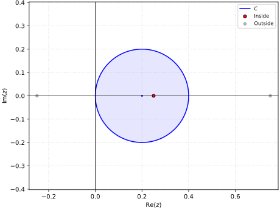
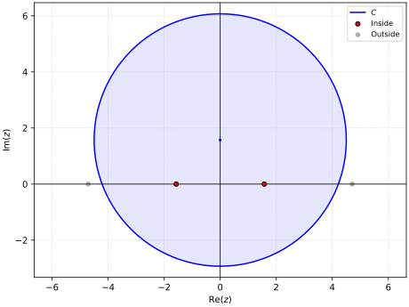
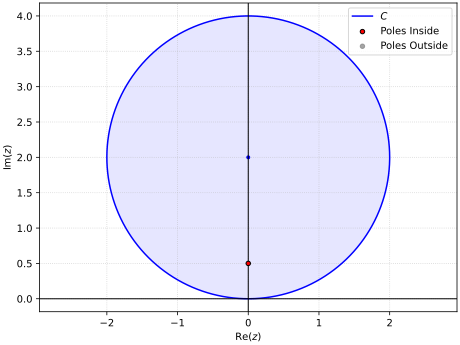
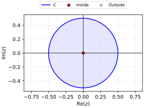
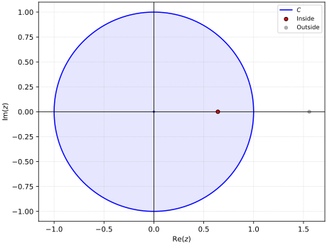
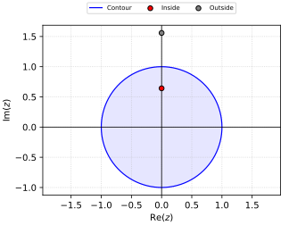

# Problem 16.3.15

Evaluate counterclockwise.

$$
\oint_C \tan 2 \pi z \ dz, 
\quad C:\abs{z - 0.2} = 0.2
$$

## Solution

The function $f(z) = \tan 2 \pi z = \frac{\sin 2 \pi z}{\cos 2 \pi z}$ has simple poles at

$$
\cos 2 \pi z = 0
\implies 2 \pi z = \frac{\pi}{2} + n\pi
\implies z = \frac{1}{4} + \frac{n}{2}, \ n \in \mathbb{Z}
$$

Only $z_0 = \frac{1}{4}$ lies in $C$,

{width=2in}

$$
\Res_{z = z_0} f(z) 
= \frac{p(z_0)}{q'(z_0)} 
= \frac{\sin 2 \pi z}{-2 \pi\sin 2 \pi z} 
= -\frac{1}{2 \pi}
$$

The integral is then in the form, $$\oint_C f(z) \ dz = 2 \pi i \Res_{z = z_0} f(z)$$

$$
\oint_C \tan 2 \pi z \ dz 
= 2 \pi i \Res_{z = \frac{1}{4}} f(z)
= \boxed{-i} 
$$

\newpage
# Problem 16.3.17

Evaluate counterclockwise.

$$
\oint_C \frac{e^z}{\cos z} \ dz, 
\quad C:\abs{z - \frac{\pi i}{2}} = 4.5
$$

## Solution

The function $f(z) = \frac{e^z}{\cos z}$ has simple poles at

$$
\cos z = 0
\implies z = \frac{\pi}{2} + n\pi, \ n \in \mathbb{Z}
$$

Poles at $z_{1,2} = \pm \frac{\pi}{2}$ lie within the region,

{width=2in}

$$
\Res_{z = z_0} f(z) 
= \frac{p(z_0)}{q'(z_0)} 
= -\frac{e^{z_0}}{\sin z_0}
$$

$$
\Res_{z = \frac{\pi}{2}} f(z)
= -\frac{e^{\frac{\pi}{2}}}{\sin \frac{\pi}{2}}
= -e^{\frac{\pi}{2}}
$$

$$
\Res_{z = -\frac{\pi}{2}} f(z)
= -\frac{e^{-\frac{\pi}{2}}}{\sin -\frac{\pi}{2}}
= e^{-\frac{\pi}{2}}
$$

The integral is then in the form, $$\oint_C f(z) \ dz = 2 \pi i \sum_{j=1}^{k} \Res_{z = z_j} f(z)$$

$$
\oint_C \frac{e^z}{\cos z} \ dz
= 2 \pi i \parens{-e^{\frac{\pi}{2}} + e^{-\frac{\pi}{2}}}
= \boxed{-4 \pi i \sinh \parens{\frac{\pi}{2}}}
$$

\newpage
# Problem 16.3.19

Evaluate counterclockwise.

$$
\oint_C \frac{\sinh z}{2z - i} \ dz, 
\quad C:\abs{z - 2i} = 2
$$

## Solution

The function $f(z) = \frac{\sinh z}{2z - i}$ has simple poles at

$$
2z - i = 0
\implies z = \frac{i}{2}
$$

The pole at $z_0 = \frac{i}{2}$ lies within the region,

{width=2in}

$$
\Res_{z = z_0} f(z) 
= \frac{p(z_0)}{q'(z_0)}
= \frac{1}{2} \sinh z_0
$$

$$
\Res_{z = \frac{i}{2}} f(z) 
= \frac{1}{2} \sinh \frac{i}{2}
= \frac{i}{2} \sin \frac{1}{2}
$$

The integral is then in the form, $$\oint_C f(z) \ dz = 2 \pi i \Res_{z = z_0} f(z)$$

$$
\oint_C \frac{\sinh z}{2z - i} \ dz
= 2 \pi i \parens{\frac{i}{2} \sin \frac{1}{2}}
= \boxed{-\pi \sin \frac{i}{2}}
$$

\newpage
# Problem 16.3.21

Evaluate counterclockwise.

$$
\oint_C \frac{\cos \pi z}{z^5} \ dz, 
\quad C:\abs{z} = \frac{1}{2}
$$

## Solution

The function $f(z) = \frac{\cos \pi z}{z^5}$ has a 5th-order pole at

$$
z^5 = 0
\implies z = 0
$$

The pole at $z_0 = 0$ lies within the region,

{width=2in}

$$
\Res_{z = 0} f(z) 
= \frac{1}{4!} \lim_{z \to 0} \braces{\frac{d^4}{dz^4} \brackets{z^4 f(z)}}
= \frac{1}{24} \frac{d^4}{dz^4} \brackets{\cos \pi z}\Big|_{z=0}
= \frac{\pi^4}{24} \cos \pi z\Big|_{z=0}
= \frac{\pi^4}{24}
$$

The integral is then in the form, $$\oint_C f(z) \ dz = 2 \pi i \Res_{z = z_0} f(z)$$

$$
\oint_C \frac{\cos \pi z}{z^5} \ dz
= 2 \pi i \parens{\frac{\pi^4}{24}}
= \boxed{\frac{i \pi^5}{12}}
$$

\newpage
# Problem 16.4.1

Evaluate.

$$
\int_0^\pi \frac{2}{k - \cos \theta} \ d\theta
$$

## Solution

The integral can be converted to a complex integral by substituting $z = e^{i\theta}$

$$
\int_0^\pi \frac{2}{k - \cos \theta} \ d\theta
= \int_0^{2\pi} \frac{1}{k - \cos \theta} \ d\theta
= \oint_C \frac{1}{k - \frac{1}{2} \parens{z + \frac{1}{z}}} \ \frac{dz}{iz}
= 2i \oint_C \frac{1}{z^2 - 2kz + 1} \ dz
$$

Where $C$ is the the unit circle in the complex plane.

$f(z) = \frac{1}{z^2 - 2kz + 1}$ has simple poles where

$$
z^2 - 2kz + 1 = 0
\implies z = \frac{2k \pm \sqrt{4k^2 - 4}}{2} = k \pm \sqrt{k^2 - 1}
$$

$$
z_1 = k - \sqrt{k^2 - 1}
\quad
z_2 = k + \sqrt{k^2 - 1}
$$

$$
\Res_{z = z_0} f(z) 
= \frac{1}{2 z_0 - 2 k}
= \frac{1}{2 (z_0 - k)}
$$

$$
\Res_{z = z_{1,2}} f(z) 
= \frac{1}{2 (k \pm \sqrt{k^2 - 1} - k)}
= \pm \frac{1}{2\sqrt{k^2 - 1}}
$$

Assuming $k > 1$, only $z_1$ lies within $C$,

{width=2in}

$$
\begin{aligned}
\oint_C f(z) \ dz 
    &= 2 \pi i \Res_{z = z_0} f(z) \\
\oint_C \frac{1}{z^2 - 2kz + 1} &= 2 \pi i \parens{- \frac{1}{2\sqrt{k^2 - 1}}}
    &= - \frac{\pi i}{\sqrt{k^2 - 1}} \\
\int_0^\pi \frac{2}{k - \cos \theta} \ d\theta 
    &= 2i \parens{- \frac{\pi i}{\sqrt{k^2 - 1}}} \\
    &= \boxed{\frac{2 \pi}{\sqrt{k^2 - 1}}} \\
\end{aligned}
$$

\newpage
# Problem 16.4.7

Evaluate.

$$
\int_0^{2\pi} \frac{a}{a - \sin \theta} \ d\theta
$$

## Solution

The integral can be converted to a complex integral by substituting $z = e^{i\theta}$

$$
\int_0^{2\pi} \frac{a}{a - \sin \theta} \ d\theta
= \oint_C \frac{a}{a - \frac{1}{2i} \parens{z - \frac{1}{z}}} \ \frac{dz}{iz}
= -2a \oint_C \frac{1}{z^2 - 2aiz - 1} \ dz
$$

Where $C$ is the the unit circle in the complex plane.

$f(z) = \frac{1}{z^2 - 2aiz - 1}$ has simple poles where

$$
z^2 - 2aiz - 1 = 0
\implies z = \frac{2ai \pm \sqrt{-4a^2 + 4}}{2} = ai \pm \sqrt{1 - a^2}
$$

Assuming $a > 1$

$$
z_1 = \parens{a - \sqrt{a^2 - 1}}i
\quad
z_2 = \parens{a + \sqrt{a^2 - 1}}i
$$

$$
\Res_{z = z_0} f(z) 
= \frac{1}{2 z_0 - 2ai}
= \frac{1}{2 (z_0 - ai)}
$$

$$
\Res_{z = z_{1,2}} f(z) 
= \frac{1}{2 (\parens{a \pm \sqrt{a^2 - 1}}i - ai)}
= \pm \frac{1}{2i \sqrt{a^2 - 1}}
$$

Only $z_1$ lies within $C$,

{width=2in}

$$
\begin{aligned}
\oint_C f(z) \ dz 
    &= 2 \pi i \Res_{z = z_0} f(z) \\
\oint_C \frac{1}{z^2 - 2kz + 1} &= 2 \pi i \parens{-\frac{1}{2i \sqrt{a^2 - 1}}}
    &= - \frac{\pi}{\sqrt{a^2 - 1}} \\
\int_0^{2\pi} \frac{a}{a - \sin \theta} \ d\theta
    &= -2a \parens{- \frac{\pi}{\sqrt{a^2 - 1}}} \\
    &= \boxed{\frac{2 a \pi}{\sqrt{a^2 - 1}}} \\
\end{aligned}
$$

\newpage
# Problem 16.4.9

Evaluate.

$$
\int_0^{2\pi} \frac{\cos \theta}{13 - 12 \cos 2\theta} \ d\theta
$$

## Solution

\newpage
# Problem 16.4.11

Evaluate.

$$
\infint \frac{1}{\parens{1 + x^2}^2} \ dx
$$

## Solution

\newpage
# Problem 16.4.15

Evaluate.

$$
\infint \frac{x^2}{x^6 + 1} \ dx
$$

## Solution

\newpage
# Problem 16.4.17

Evaluate.

$$
\infint \frac{\sin 3x}{x^4 + 1} \ dx
$$

## Solution

\newpage
# Problem 16.4.19

Evaluate.

$$
\infint \frac{1}{x^4 - 1} \ dx
$$

## Solution

\newpage
# Problem 16.4.21

Evaluate.

$$
\infint \frac{\sin x}{\parens{x - 1} \parens{x^2 + 4}} \ dx
$$

## Solution

\newpage
# Problem 16.4.25

Find the Cauchy principal value.

$$
\infint \frac{x+5}{x^3 - x} \ dx
$$
