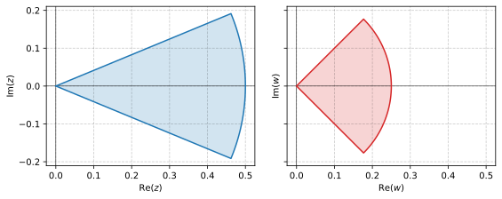
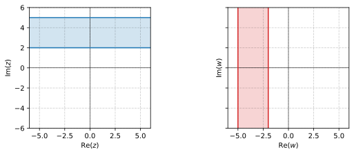
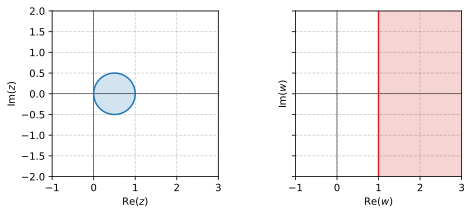
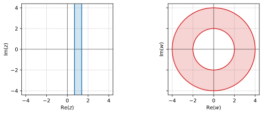
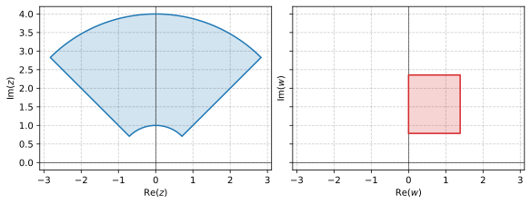

# Problem 17.1.11

Sketch or graph the given region and its image under the given mapping.

$$
\abs{z} \leqq \frac{1}{2}, \quad
-\frac{\pi}{8} < \Arg z < \frac{\pi}{8}, \quad
w = z^2
$$

## Solution

$$
z = r e^{i \theta}
$$

$$
\begin{aligned}
w &= R e^{i \phi} \\
z^2 &= r^2 e ^{2 i \theta}
\end{aligned}
$$

$$
R = r^2 = \frac{1}{4}
$$

$$
\phi = 2 \theta \implies -\frac{\pi}{4} < \Arg w < \frac{\pi}{4}
$$

\newpage
# Problem 17.1.13

Sketch or graph the given region and its image under the given mapping.

$$
2 \leqq \Im z \leqq 5, \quad
w = iz
$$

## Solution

The region is an infinite strip bounded by $z_1 = 2i$ and $z_2 = 5i$, mapping to $w = iz$ gives another infinite strip bounded by

$$
w_1 = i z_1 = -2
$$

$$
w_2 = i z_2 = -5
$$

\newpage
# Problem 17.1.15

Sketch or graph the given region and its image under the given mapping.

$$
\abs{z - \frac{1}{2}} \leqq \frac{1}{2}, \quad
w = \frac{1}{z}
$$

## Solution

The boundary of the region $z = x + iy$ has the equation

$$
\begin{aligned}
\parens{x - \frac{1}{2}}^2 + y^2 &= \parens{\frac{1}{2}}^2 \\
x^2 - x + \frac{1}{4} + y^2 &= \frac{1}{4} \\
x^2 - x + y^2 &= 0 \\
x^2 + y^2 &= x \implies \abs{z}^2 = \Re z
\end{aligned}
$$

Applying this relation to $w = u + iv = \frac{1}{z}$ we can find the boundary of the mapping.

$$
\begin{aligned}
\abs{\frac{1}{w}}^2 = \Re \frac{1}{w} \\
\frac{1}{\abs{w}^2} = \Re \frac{1}{u + iv} \\
\frac{1}{\abs{w}^2} = \Re \frac{u - iv}{u^2 + v^2} \\
\frac{1}{\abs{w}^2} = \frac{u}{\abs{w}^2} \\
u = 1 \\
\end{aligned}
$$

This is a vertical line. Since $z_c = \frac{1}{2}$ is within the original region, then $w_c = \frac{1}{z_c} = 2$ which is on the right side of the boundary and therefore the mapped region is the half plane on the positive side of $u=1$

\newpage
# Problem 17.1.17

Sketch or graph the given region and its image under the given mapping.

$$
\Ln 2 \leqq x \leqq \Ln 4, \quad
w = e^z
$$

## Solution

The region is an infinite vertical strip bounded by $z_1 = \Ln 2$ and $z_2 = \Ln 4$,

$$
\abs{w_1} = \abs{e^{z_1}} = \abs{e^{\Ln 2}} = 2
$$

$$
\abs{w_2} = \abs{e^{z_2}} = \abs{e^{\Ln 4}} = 4
$$

The new boundary is two concentric circles.

\newpage
# Problem 17.1.19

Sketch or graph the given region and its image under the given mapping.

$$
1 < \abs{z} < 4, \quad
\frac{\pi}{4} < \theta \leqq \frac{3\pi}{4}, \quad
w = \Ln z
$$

## Solution

The region is bounded by 4 borders that can be described in the form $z = r e^{i \theta}$. 

Mapping to 
$$
\begin{aligned}
w 
&= \Ln z \\
&= \ln \abs{z} + i \Arg z \\
&= \ln r + i \theta \\
&= u + i v
\end{aligned}
$$

$$
u = r 
\implies \ln 1 < u < \ln 4
$$

$$
v = \theta
\implies \frac{\pi}{4} < v \leqq \frac{3\pi}{4}
$$

\newpage
# Problem 17.2.7

Find the inverse $z = z(w)$ Check by solving $z(w)$ for $w$.

$$
w = \frac{i}{2z - 1}
$$

## Solution

$$
\begin{aligned}
w &= \frac{i}{2z - 1} \\
2z - 1 &= \frac{i}{w} \\
z &= \frac{i}{2w} + \frac{1}{2} \\
\end{aligned}
$$

$$
\boxed{z(w) = \frac{i}{2w} + \frac{1}{2}}
$$

\newpage
# Problem 17.2.13

Find the fixed points.

$$
w = 16 z^5
$$

## Solution

$$
\begin{aligned}
f(z) &= z \\
w = 16 z^5 &= z \\
16 z^5 - z &= 0 \\
z \parens{16 z^4 - 1} &= 0
&\implies \boxed{z = 0, \ \pm \frac{1}{2}, \ \pm \frac{1}{2} i}
\end{aligned}
$$

\newpage
# Problem 17.2.15

Find the fixed points.

$$
w = \frac{iz + 4}{2z - 5i}
$$

## Solution

$$
\begin{aligned}
f(z) &= z \\
w = \frac{iz + 4}{2z - 5i} &= z \\
iz + 4 &= 2z^2 - 5iz \\
0 &= 2z^2 - 6iz - 4 \\
0 &= z^2 - 3iz - 2
&\implies \boxed{z = \frac{3i \pm i}{2} = i, 2i} \\
\end{aligned}
$$

\newpage
# Problem 17.2.19

Find all LFTs with fixed point(s).

$$
z = \pm i
$$

## Solution

\newpage
# Problem 17.3.9

Find the Linear Fractional Transformation (LFT) that maps the given three points onto the three given points in the respective order.

$$
1, \ i, \ -1 \text{ onto } i, \ -1, \ -i
$$

## Solution

\newpage
# Problem 17.3.11

Find the LFT that maps the given three points onto the three given points in the respective order.

$$
-1, \ 0, \ 1 \text{ onto } -i, \ -1, \ i
$$

## Solution

\newpage
# Problem 17.4.1

Find the image of $x = c = \text{const}$, $-\pi < y \leqq \pi$, under $w = e^z$.

## Solution

\newpage
# Problem 17.4.3

Find and sketch the image of the given region under $w = e^z$.

$$
-\frac{1}{2} \leqq x \leqq \frac{1}{2}, \quad
-\pi \leqq y \leqq \pi
$$

## Solution

\newpage
# Problem 17.4.5

Find and sketch the image of the given region under $w = e^z$.

$$
-\infty \leqq x \leqq \infty, \quad
0 \leqq y \leqq 2\pi
$$

## Solution

\newpage
# Problem 17.4.7

Find and sketch the image of the given region under $w = e^z$.

$$
0 < x < 1, \quad
0 < y < \pi
$$

## Solution

\newpage
# Problem 17.4.11

Find and sketch or graph the image of the given region under $w = \sin z$.

$$
0 < x < \frac{\pi}{2}, \quad
0 < y < 2
$$

## Solution

\newpage
# Problem 17.4.13

Find and sketch or graph the image of the given region under $w = \sin z$.

$$
0 < x < 2\pi, \quad
1 < y < 3
$$

## Solution

\newpage
# Problem 17.4.19

Find the images of the lines mapping $x = c = \text{const}$ under the mapping $w = \cos z$.

## Solution

\newpage
# Problem 17.4.21

Find and sketch or graph the image of the given region under the mapping $w = \cos z$ directly from **Problem 17.4.11**.

$$
0 < x < \frac{\pi}{2}, \quad
0 < y < 2
$$

## Solution
