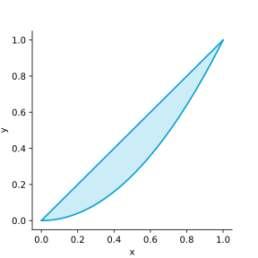
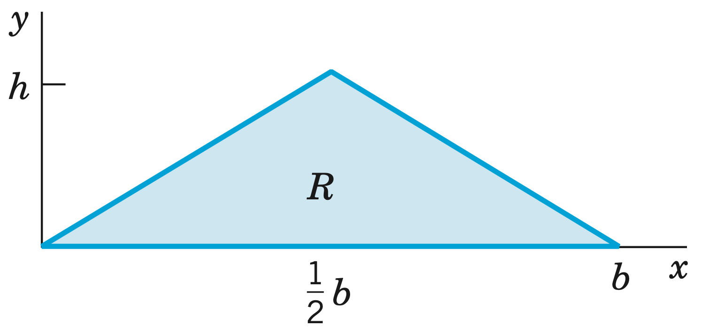
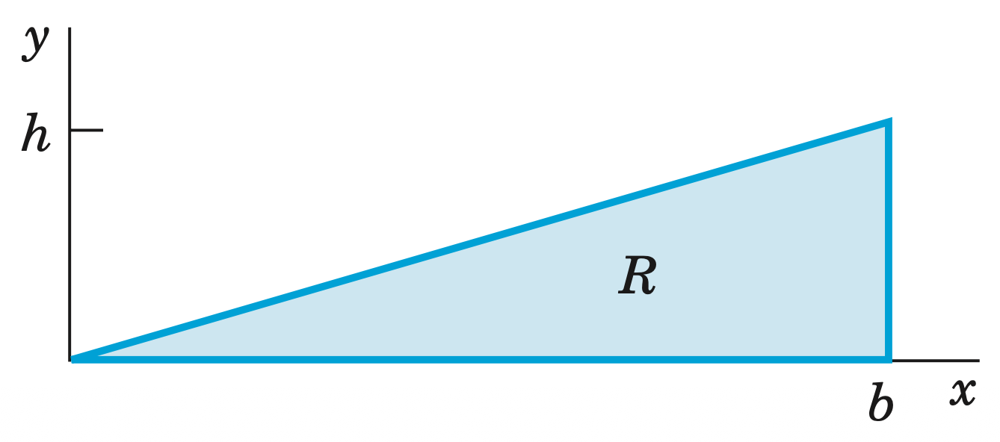

# Problem 10.2.3.

Show that the form under the integral sign is exact in the plane and evaluate the integral. Show the details of your work.

$$\int_{(\pi / 2, \pi)}^{(\pi, 0)} \parens{\frac{1}{2} \cos \frac{1}{2} x \cos 2y \ dx -2 \sin \frac{1}{2} x \sin 2y \ dy}$$

## Solution.

The form is exact iff $\curl \mathbf{F} = \mathbf{0}$, where $\mathbf{F} = \brackets{\frac{1}{2} \cos \frac{1}{2} x \cos 2y, -2 \sin \frac{1}{2} x \sin 2y}$. For 2D $\mathbf{F}$,

$$
\begin{aligned}
\curl \mathbf{F} &= (F_2)_x - (F_1)_y \\
&= \parens{-\cos \frac{1}{2} x \sin 2y} - \parens{-\cos \frac{1}{2} x \sin 2y} \\
&= 0
\end{aligned}
$$

Therefore the form is **exact**. The integral takes the form,

$$\int_A^B \mathbf{F} \cdot d\mathbf{r} = \int_A^B df = f(B) - f(A)$$

Finding $f$, such that $\grad f = \mathbf{F}$,

$$
f 
= \int F_1 dx 
= \int \frac{1}{2} \cos \frac{1}{2} x \cos 2y \ dx 
= \sin \frac{1}{2} x \cos 2y + g(x)
$$

$$
f_y 
= -2 \sin \frac{1}{2} x \sin 2y + g_y 
= F_2 
= -2 \sin \frac{1}{2} x \sin 2y
\implies g_y = 0
\implies g = 0
$$

$$f = \sin \frac{1}{2} x \cos 2y$$

The integral is then,

$$
\begin{aligned}
\int_{(\pi / 2, \pi)}^{(\pi, 0)} df 
&= f(\pi, 0) - f(\pi / 2, \pi) \\ 
&= \boxed{1 - \frac{\sqrt 2}{2}}
\end{aligned}
$$

# Problem 10.2.5.

Show that the form under the integral sign is exact in space and evaluate the integral. Show the details of your work.

$$\int_{(0,0, \pi)}^{(2,1 / 2, \pi / 2)} e^{x y} (y \sin z \ dx + x \sin z \ dy + \cos z \ dz)$$

## Solution.

The form is exact iff $\curl \mathbf{F} = \mathbf{0}$, where $\mathbf{F} = e^{x y} \brackets{y \sin z, x \sin z, \cos z}$.

$$
\begin{aligned}
\curl \mathbf{F} &= \left| \begin{matrix}
\mathbf{i} & \mathbf{j} & \mathbf{k} \\
\pder{x} & \pder{y} & \pder{z} \\
F_1 & F_2 & F_3
\end{matrix} \right| \\
&= \begin{bmatrix}
    (F_3)_y - (F_2)_z \\
    (F_1)_z - (F_3)_x \\
    (F_2)_x - (F_1)_y
\end{bmatrix} 
= \begin{bmatrix}
    \parens{x e^{x y} \cos z}  - \parens{x e^{x y} \cos z} \\
    \parens{y e^{x y} \cos z}  - \parens{y e^{x y} \cos z} \\
    \parens{xy e^{x y} \sin z + e^{x y} \sin z}  - \parens{xy e^{x y} \sin z + e^{x y} \sin z}
\end{bmatrix} 
= \mathbf{0}
\end{aligned}
$$

Therefore the form is **exact**. The integral takes the form,

$$\int_A^B \mathbf{F} \cdot d\mathbf{r} = \int_A^B df = f(B) - f(A)$$

Finding $f$, such that $\grad f = \mathbf{F}$,

$$
f 
= \int F_1 dx 
= \int e^{x y} y \sin z \ dx 
= e^{x y} \sin z + g(y, z)
$$

$$
f_y 
= x e^{x y} \sin z + g_y 
= F_2 
= x e^{x y} \sin z
\implies g_y = 0
\implies g = h(z)
$$

$$
f_z 
= e^{x y} \cos z + h'(z) 
= F_3 
= e^{x y} \cos z
\implies h'(z) = 0 
\implies h(z) = 0
$$

$$f = e^{x y} \sin z$$

The integral is then,

$$
\begin{aligned}
\int_{(0,0, \pi)}^{(2,1 / 2, \pi / 2)} df 
&= f(2,1 / 2, \pi / 2) - f(0,0, \pi) \\
&= e \sin (\pi / 2) - e^{0} \sin (\pi) \\
&= \boxed{e}
\end{aligned}
$$

# Problem 10.2.13.

Check, and if independent, integrate from $(0, 0, 0)$ to $(a, b, c)$.

$$2e^{x^2} (x \cos 2y \ dx - \sin 2y \ dy)$$

## Solution.

The integral is independent iff $\curl \mathbf{F} = \mathbf{0}$, where $\mathbf{F} = 2e^{x^2} \brackets{x \cos 2y, - \sin 2y}$. For 2D $\mathbf{F}$,

$$
\begin{aligned}
\curl \mathbf{F} &= (F_2)_x - (F_1)_y \\
&= \parens{-4 x e^{x^2}\sin 2y} - \parens{-4 x e^{x^2}\sin 2y} \\
&= 0
\end{aligned}
$$

Therefore the integral is **independent of path**. The integral takes the form,

$$\int_A^B \mathbf{F} \cdot d\mathbf{r} = \int_A^B df = f(B) - f(A)$$

Finding $f$, such that $\grad f = \mathbf{F}$,

$$
f 
= \int F_1 dx 
= \int 2e^{x^2} x \cos 2y \ dx 
= e^{x^2} \cos 2y + g(y)
$$

$$
f_y 
= -2 e^{x^2} \sin 2y + g_y 
= F_2 
= -2 e^{x^2} \sin 2y 
\implies g_y = 0 
\implies g(y) = 0
$$

$$
f = e^{x^2} \cos 2y
$$

The integral is then,

$$
\begin{aligned}
\int_{(0,0,0)}^{(a,b,c)} df 
&= f(a,b,c) - f(0,0,0) \\
&= e^{a^2} \cos 2b - e^{0} \cos 0 \\
&= \boxed{e^{a^2} \cos 2b - 1}
\end{aligned}
$$

# Problem 10.2.16.

Check, and if independent, integrate from $(0, 0, 0)$ to $(a, b, c)$.

$$e^y \ dx + (x e^y - e^z) \ dy - y e^z \ dz$$

## Solution.

The integral is independent iff $\curl \mathbf{F} = \mathbf{0}$, where $\mathbf{F} = \brackets{e^y, (x e^y - e^z), -y e^z}$.

$$
\begin{aligned}
\curl \mathbf{F} &= \left| \begin{matrix}
\mathbf{i} & \mathbf{j} & \mathbf{k} \\
\pder{x} & \pder{y} & \pder{z} \\
e^y & (xe^y - e^z) & -y e^z
\end{matrix} \right| \\
&= \brackets{
    \parens{\pder{y} (-y e^z) - \pder{z} (x e^y - e^z)}, 
    \parens{\pder{z} (e^y) - \pder{x} (-y e^z)},
    \parens{\pder{x} (xe^y - e^z) - \pder{y} (e^y)}
    } \\
&= \brackets{
    \parens{(-e^z) - (-e^y)}, 
    \parens{0 - 0},
    \parens{e^y - e^y}
    } \\
&= \mathbf{0}
\end{aligned}
$$

Therefore the integral is **independent of path**. The integral takes the form,

$$\int_A^B \mathbf{F} \cdot d\mathbf{r} = \int_A^B df = f(B) - f(A)$$

Finding $f$, such that $\grad f = \mathbf{F}$,

$$
f
= \int F_2 dy
= \int (x e^y - e^z) dy
= x e^y - y e^z + g(x, z)
$$

$$
f_x 
= e^y + g_x
= F_1
= e^y
\implies g_x = 0 
\implies g(x, z) = h(z)
$$

$$
f_z
= -y e^z + h_z
= F_3
= -y e^z
\implies h_z = 0
\implies h(z) = 0
$$

$$
f
= x e^y - y e^z
$$

The integral is then,

$$
\begin{aligned}
\int_{(0,0,0)}^{(a,b,c)} df &= f(a,b,c) - f(0,0,0) \\
&= (a e^b - b e^c) - (0 - 0) \\
&= \boxed{a e^b - b e^c}
\end{aligned}
$$

# Problem 10.3.5.

Describe the region of integration and evaluate.

$$\int_0^1 \int_{x^2}^x \parens{1 - 2xy} \ dy \ dx$$

## Solution.

The region of integration is the volume under the surface $z = 1 - 2xy$ for $y \in [x^2, x]$ and $x \in [0, 1]$. The region on the xy-plane looks like a slim leaf-like shape.

{width=2in}\ 

$$
\begin{aligned}
\int_0^1 \int_{x^2}^x (1 - 2xy) \ dy \ dx &= \int_0^1 \brackets{y - x y^2}_{x^2}^x \ dx \\
&= \int_0^1 \brackets{x - x^2 - x^3 + x^5} \ dx \\
&= \brackets{\frac{x^2}{2} - \frac{x^3}{3} - \frac{x^4}{4} + \frac{x^6}{6}}_0^1 \\
&= \frac{1}{2} - \frac{1}{3} - \frac{1}{4} + \frac{1}{6} \\
&= \boxed{\frac{1}{12}}
\end{aligned}
$$

# Problem 10.3.10.

Find the volume of the first octant region bounded by the coordinate planes and the surfaces $y = 1 - x^2$ and $z = 1 - x^2$. Sketch it.

## Solution.

$$
\begin{aligned}
V &= \int_0^1\int_0^{1-x^2}\int_0^{1-x^2} \ dz \ dy \ dx \\
&= \int_0^1\int_0^{1-x^2} \brackets{z}_0^{1-x^2} \ dy \ dx \\
&= \int_0^1\int_0^{1-x^2} (1-x^2) \ dy \ dx \\
&= \int_0^1 \brackets{y(1-x^2)}_0^{1-x^2} \ dx \\
&= \int_0^1 (1-x^2)(1-x^2) \ dx \\
&= \int_0^1 (1 - 2x^2 + x^4) \ dx \\
&= x - \frac{2}{3} x^3 + \frac{1}{5} x^5 \Big|_0^1 \\
&= 1 - \frac{2}{3} + \frac{1}{5} \\
&= \boxed{\frac{8}{15}}
\end{aligned}
$$

{width=3in}\ 

# Problem 10.3.12.

Find the center of gravity $\parens{\bar x, \bar y}$ of a mass of density $f(x, y) = 1$ in the given region $R$.

{width=2in}\ 

## Solution.

# Problem 10.3.17.

Find $I_x$, $I_y$, $I_0$ of a mass of density $f(x, y) = 1$ in the region $R$.

{width=2in}\ 

## Solution.
