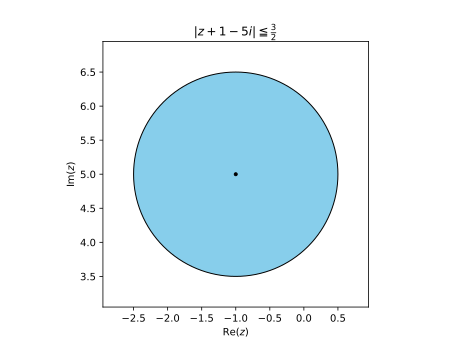
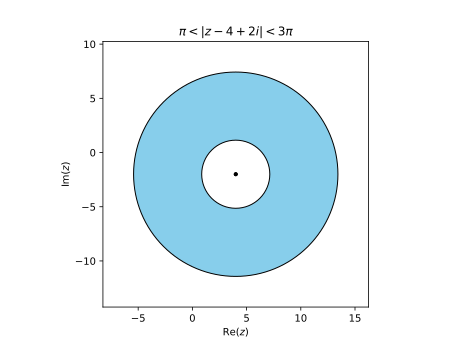
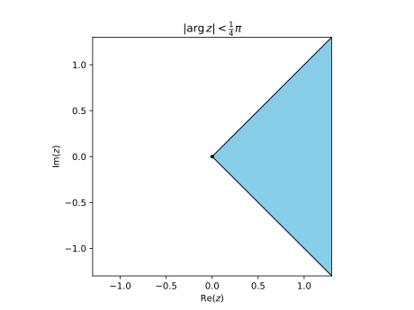
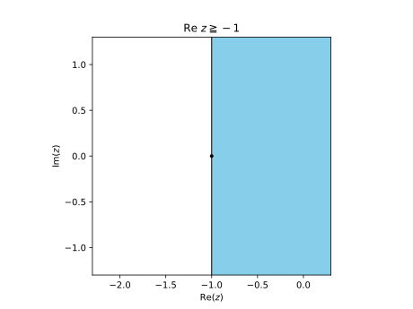

# Problem 13.3.1

Determine and sketch or graph the sets in the complex plane given by

$$|z + 1 - 5i| \leqq \frac{3}{2}$$

## Solution

$$|z - (-1 + 5i)| \leqq \frac{3}{2}$$

This is a closed disc centered at $(-1 + 5i)$ with radius $1.5$

{width=2.5in}

# Problem 13.3.3

Determine and sketch or graph the sets in the complex plane given by

$$\pi < |z - 4 + 2i| < 3\pi$$

## Solution

$$\pi < |z - (4 - 2i)| < 3\pi$$
This is an open disc centered at $(4 - 2i)$ with outer radius $3\pi$, and inner radius $\pi$

{width=2.5in}

# Problem 13.3.5

Determine and sketch or graph the sets in the complex plane given by

$$|\arg z| < \frac{1}{4}\pi$$

## Solution

$$-\frac{1}{4}\pi < \arg z < \frac{1}{4}\pi$$

This is a wedge from $-\frac{1}{4}\pi$ to $\frac{1}{4}\pi$. There is no bound to the radius of the wedge.

{width=2.5in}

# Problem 13.3.7

Determine and sketch or graph the sets in the complex plane given by

$$\Re z \geqq -1$$

## Solution

This covers the right half of plane bounded at the left by $x=-1$.

{width=2.5in}

# Problem 13.3.11

Find $\Re f$, and $\Im f$ and their values at the given point $z$.

$$f(z) = \frac{1}{1-z} \text{ at } 1 - i$$

## Solution

$z = x+iy$

$$
\begin{aligned}
f(z)
&= \frac{1}{1 - (x+iy)} \\
&= \frac{1}{(1-x) - iy} \\
&= \frac{1}{(1-x) - iy} \cdot \frac{(1-x) + iy}{(1-x) + iy} \\
&= \frac{(1-x) + iy}{(1-x)^2 + y^2} \\
\end{aligned}
$$

$$
\boxed{\Re f(z) = \frac{1-x}{(1-x)^2 + y^2}}
\quad
\boxed{\Im f(z) = \frac{y}{(1-x)^2 + y^2}}
$$

$$
\boxed{\Re f(1 - i) = 0}
\quad
\boxed{\Im f(1 - i) = -1}
$$

# Problem 13.3.23

Find the value of the derivative of

$$\frac{z^3}{(z + 1)^3} \text{ at } i$$

## Solution

$$
\begin{aligned}
f(z) &= \parens{\frac{z}{z + 1}}^3 \\
\\
f'(z) 
&= 3\parens{\frac{z}{z + 1}}^2\parens{\frac{(z + 1) - z}{(z + 1)^2}} \\
&= \frac{3z^2}{(z + 1)^4} \\
\\
f'(i) &= \frac{3i^2}{(i + 1)^4} \\
&= \boxed{\frac{3}{4}}
\end{aligned}
$$

# Problem 13.4.3

Is $f$ analytic?

$$f(z) = e^{-2x} (\cos 2y - i \sin 2y)$$

## Solution

$$
f(z) = u(x,y) + iv(x,y)
$$

$$
\begin{aligned}
u &= e^{-2x} \cos 2y \\
u_x &= -2e^{-2x} \cos 2y \\
u_y &= -2e^{-2x} \sin 2y
\end{aligned}
\quad
\begin{aligned}
v &= -e^{-2x} \sin 2y \\
v_x &= 2e^{-2x} \sin 2y \\
v_y &= -2e^{-2x} \cos 2y
\end{aligned}
$$

Since $u_x = v_y$ and $u_y = -v_x$, $f$ is **analytic**.

# Problem 13.4.5

Is $f$ analytic?

$$f(z) = \Re (z^2) - i \Im (z^2)$$

## Solution

$$
z^2 = (x + iy)^2 = x^2 - y^2 + i2xy
$$

$$
f(z) = u(x,y) + iv(x,y)
$$

$$
\begin{aligned}
u &= x^2 - y^2  \\
u_x &= 2x \\
u_y &= -2y
\end{aligned}
\quad
\begin{aligned}
v &= 2xy \\
v_x &= 2y \\
v_y &= 2z
\end{aligned}
$$

Since $u_x = v_y$ and $u_y = -v_x$, $f$ is **analytic**.

# Problem 13.4.7

Is $f$ analytic?

$$f(z) = \frac{i}{z^8}$$

## Solution

$$
f'(z) = -8\frac{i}{z^9}
$$

Since $f$ is differentiable everywhere (except $z=0$), $f$ is **analytic**.

# Problem 13.4.13

Is the function harmonic? If yes, find a corresponding analytic function $f(z) = u(x, y) + iv(x, y)$.

$$u = xy$$

## Solution

$\laplacian u = 0$, and therefore the function is **harmonic**.

$$
u_x = y = v_y 
\quad \implies \quad
v = \frac{1}{2}y^2 + h(x)
$$

$$
v_x = h'(x) = -u_y = -x 
\quad \implies \quad
h(x) = -\frac{1}{2}x^2 + c$$

Therefore,

$$\boxed{f(z) = xy + i\frac{1}{2}(y^2 - x^2 + c)}$$

# Problem 13.4.17

Is the function harmonic? If yes, find a corresponding analytic function $f(z) = u(x, y) + iv(x, y)$.

$$v = (2x + 1)y$$

## Solution

$\laplacian v = 0$, and therefore the function is **harmonic**.

$$
v_x = 2y = -u_y
\quad \implies \quad
u = -y^2 + h(x)
$$

$$
u_x = h'(x) = v_y = 2x + 1
\quad \implies \quad
h(x) = x^2 + x + c$$

Therefore,

$$\boxed{f(z) = x^2 + x - y^2 + c + i(2xy + y)}$$

# Problem 13.4.23

Determine $a$ and $b$ so that the given function is harmonic and find a harmonic conjugate.

$$u = ax^3 + bxy$$

## Solution

$$
\begin{aligned}
\laplacian u &= u_{xx} + u_{yy} \\
&= 6ax + 0 = 0 \implies a = 0, \ b \text{ is free}
\end{aligned}
$$

$$u = bxy$$

$$
u_x = by = v_y 
\quad \implies \quad
v = \frac{b}{2}y^2 + h(x)
$$

$$
v_x = h'(x) = -u_y = -bx 
\quad \implies \quad
h(x) = -\frac{b}{2}x^2 + c
$$

$$
\boxed{v(x,y) = \frac{b}{2}(y^2 - x^2 + c)}
$$

# Problem 13.5.3

Find $e^z$ in the form $u + iv$ and $|e^z|$ if

$$z = 2 \pi i (1 + i)$$

## Solution

$$
\begin{aligned}
z 
&= 2 \pi i (1 + i) \\
&= 2 \pi i + 2 \pi i^2 \\
&= -2 \pi + 2 \pi i
\end{aligned}
$$

$$
\begin{aligned}
e^z 
&= e^{-2 \pi + 2 \pi i} \\
&= e^{-2 \pi} e^{2 \pi i} \\
&= e^{-2 \pi} \parens{\cos 2 \pi + i \sin 2 \pi} \\
&= e^{-2 \pi}
\end{aligned}
$$

$$
\boxed{u = e^{-2 \pi} \quad v = 0}
$$

$$
\boxed{|e^z| = e^{-2 \pi}}
$$

# Problem 13.5.9

Write in exponential form

$$4 + 3i$$

## Solution

$$z = re^{i\theta}$$

$$r = \sqrt{4^2 + 3^2} = 5$$

$$\theta = \tan^{-1} \parens{\frac{3}{4}}$$

$$\boxed{z = 5e^{i \tan^{-1} (3/4)}}$$

# Problem 13.5.15

Find $\Re$ and $\Im$ of

$$\exp(z^2)$$

## Solution

$$z^2 = x^2 - y^2 + i2xy$$

$$
\begin{aligned}
\exp(z^2)
&= \exp(x^2 - y^2 + i2xy) \\
&= \exp(x^2 - y^2) \parens{\cos 2xy + i \sin 2xy} \\
\end{aligned}
$$

$$
\boxed{
\begin{aligned}
\Re \exp(z^2) &= \exp(x^2 - y^2) \cos 2xy \\
\Im \exp(z^2) &= \exp(x^2 - y^2) \sin 2xy
\end{aligned}
}
$$

# Problem 13.5.17

Find $\Re$ and $\Im$ of

$$\exp (z^3)$$

## Solution

$$z^3 = (x^3 + 3xy^2) + i(3x^2y - y^3)$$

$$
\begin{aligned}
\exp(z^3)
&= \exp((x^3 + 3xy^2) + i(3x^2y - y^3)) \\
&= \exp(x^3 + 3xy^2) \parens{\cos (3x^2y - y^3) + i \sin (3x^2y - y^3)} \\
\end{aligned}
$$

$$
\boxed{
\begin{aligned}
\Re \exp(z^3) &= \exp(x^3 + 3xy^2) \cos (3x^2y - y^3) \\
\Im \exp(z^3) &= \exp(x^3 + 3xy^2) \sin (3x^2y - y^3)
\end{aligned}
}
$$

# Problem 13.5.19

Find all solutions and graph some of them in the complex plane.

$$e^z = 1$$

## Solution
