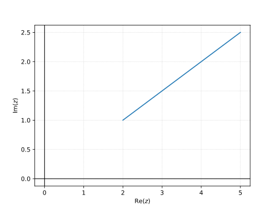
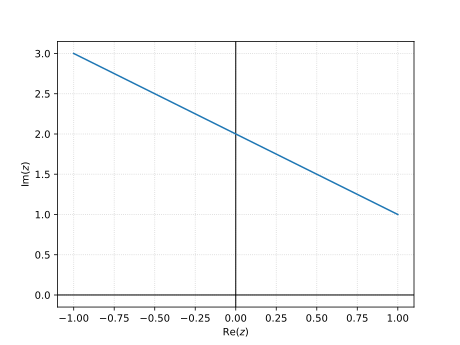
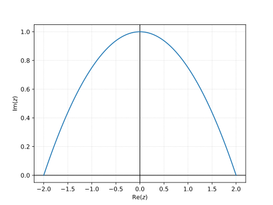

# Problem 13.6.1

Show that

a) $\sinh z = \sinh x \cos y + i \cosh x \sin y$

b) $\cosh z = \cosh x \cos y + i \sinh x \sin y$

## Solution

### a)

$$
\begin{aligned}
\sinh z &= \frac{1}{2} (e^{z} - e^{-z}) \\
&= \frac{1}{2} (e^{x+iy} - e^{-x-iy}) \\
&= \frac{1}{2} (e^x e^{iy} - e^{-x} e^{-iy}) \\
&= \frac{1}{2} (e^x (\cos y + i \sin y) - e^{-x} (\cos y - i \sin y)) \\
&= \frac{1}{2} (e^x \cos y + i e^x \sin y - e^{-x} \cos y + i e^{-x} \sin y) \\
&= \frac{1}{2} ((e^x - e^{-x}) \cos y + i (e^x + e^{-x}) \sin y) \\
&= \boxed{\sinh x \cos y + i \cosh x \sin y}
\end{aligned}
$$

### b)

$$
\begin{aligned}
\cosh z &= \frac{1}{2} (e^{z} + e^{-z}) \\
&= \frac{1}{2} (e^{x+iy} + e^{-x-iy}) \\
&= \frac{1}{2} (e^x e^{iy} + e^{-x} e^{-iy}) \\
&= \frac{1}{2} (e^x (\cos y + i \sin y) + e^{-x} (\cos y - i \sin y)) \\
&= \frac{1}{2} (e^x \cos y + i e^x \sin y + e^{-x} \cos y - i e^{-x} \sin y) \\
&= \frac{1}{2} ((e^x + e^{-x}) \cos y + i (e^x - e^{-x}) \sin y) \\
&= \boxed{\cosh x \cos y + i \sinh x \sin y}
\end{aligned}
$$

# Problem 13.6.3

Show that

a) $\cosh^2 z - \sinh^2 z = 1$

b) $\cosh^2 z + \sinh^2 z = \cosh 2z$

## Solution

### a)

$$
\begin{aligned}
\cosh^2 z - \sinh^2 z &= \frac{1}{4} (e^{z} + e^{-z})^2 - \frac{1}{4} (e^{z} - e^{-z})^2 \\
&= \frac{1}{4} \brackets{
    \parens{e^{2z} + 2 + e^{-2z}} 
    - \parens{e^{2z} - 2 + e^{-2z}}
} \\
&= \boxed{1}
\end{aligned}
$$

### b)

$$
\begin{aligned}
\cosh^2 z + \sinh^2 z &=  \frac{1}{4} (e^{z} + e^{-z})^2 + \frac{1}{4} (e^{z} - e^{-z})^2 \\
&= \frac{1}{4} \brackets{
    \parens{e^{2z} + 2 + e^{-2z}} 
    + \parens{e^{2z} - 2 + e^{-2z}}
} \\
&= \frac{1}{4} (2e^{2z} + 2e^{-2z}) \\
&= \frac{1}{2} (e^{2z} + e^{-2z}) \\
&= \boxed{\cosh 2z}
\end{aligned}
$$

# Problem 13.6.7

Find, in the form $u + iv$

a) $\cos i$

b) $\sin i$

## Solution

### a)

$$
\cos i = \boxed{\cosh 1}
$$

### b)

$$
\sin i = \boxed{i \sinh 1}
$$

# Problem 13.6.13

Using the definitions, prove

a) $\cos z$ is even, $\cos(-z) = \cos z$

b) $\sin z$ is odd, $\sin(-z) = -\sin z$

## Solution

### a)

$$
\begin{aligned}
\cos(-z) &= \frac{1}{2} \parens{e^{i \cdot (-z)} + e^{-i \cdot (-z)}} \\
&= \frac{1}{2} \parens{e^{-iz} + e^{iz}} \\
&= \boxed{\cos z}
\end{aligned}
$$

### b)

$$
\begin{aligned}
\sin(-z) &= \frac{1}{2i} \parens{e^{i \cdot (-z)} - e^{-i \cdot (-z)}} \\
&= \frac{1}{2i} \parens{e^{-iz} - e^{iz}} \\
&= \boxed{-\sin z}
\end{aligned}
$$

# Problem 13.6.16

Find all solutions

$$\sin z = 100$$

## Solution

$$
\sin z = \frac{1}{2i} \parens{e^{iz} - e^{-iz}} = 100
$$

Let $w = e^{iz}$. Then $w - w^{-1} = 100i$

$$
w^2 - 200iw - 1 = 0 \quad \implies \quad w = i(100 \pm \sqrt{9999})
$$

Thus $e^{iz} = i(100 \pm \sqrt{9999})$, so

$$
\begin{aligned}
iz &= \ln(i(100 \pm \sqrt{9999})) \\
&= \ln|i(100 \pm \sqrt{9999})| + i \Arg(i(100 \pm \sqrt{9999})) + i 2 \pi n \\
&= \ln(100 \pm \sqrt{9999}) + i \frac{\pi}{2} + i 2 \pi n \\
&= \pm \ln(100 + \sqrt{9999}) + i \pi \parens{2 n + \frac{1}{2}}\\
\end{aligned}
$$

Dividing by $i$,

$$
\boxed{
z =  \pi \parens{2 n + \frac{1}{2}} \pm \ln(100 + \sqrt{9999}) \quad n \in \mathbb{Z}
}
$$

# Problem 13.7.5

Find

$$\Ln (-11)$$

## Solution

$$
\begin{aligned}
\Ln (-11) &= \ln|-11| + i \Arg(-11) \\
&= \boxed{\ln 11 + i \pi}
\end{aligned}
$$

# Problem 13.7.7

Find

$$\Ln (4 - 4i)$$

## Solution

$$
\begin{aligned}
\Ln (4 - 4i) &= \ln|4 - 4i| + i \Arg(4 - 4i) \\
&= \ln \sqrt{4^2 + 4^2} + i \tan^{-1} \parens{\frac{-4}{4}} \\
&= \ln \sqrt{32} + i \tan^{-1} (-1) \\
&= \boxed{\frac{1}{2} \ln 32 - i\frac{\pi}{4}}
\end{aligned}
$$

# Problem 13.7.8

Find

$$\Ln (1 \pm i)$$

## Solution

$$
\begin{aligned}
\Ln (1 \pm i) &= \ln|1 \pm i| + i \Arg(1 \pm i) \\
&= \ln \sqrt{2} + i \tan^{-1} \parens{\frac{\pm 1}{1}} \\
&= \ln \sqrt{2} + i \tan^{-1} (\pm 1) \\
&= \boxed{\frac{1}{2} \ln 2 \pm i \frac{\pi}{4}} \\
\end{aligned}
$$

# Problem 13.7.15

Find all values and graph some in the complex plane

$$\ln (e^i)$$

## Solution

$$
\begin{aligned}
\ln (e^i) &= \ln |e^i| + i \Arg (e^i) + i 2 \pi n \\
&= \ln 1 + i + i 2 \pi n \\
&= \boxed{i (1 + 2 \pi n) \quad n \in \mathbb{Z}}
\end{aligned}
$$

{width=3.5in}

# Problem 13.7.19

Solve for $z$

$$\ln z = 4 - 3i$$

## Solution

$$
\begin{aligned}
e^{\ln z} &= e^{4 - 3i} \\
z &= e^{4 - 3i} \\
&= e^4 \parens{\cos(-3) + i \sin(-3)} \\
&= \boxed{e^4 \parens{\cos 3 - i \sin 3}} \\
\end{aligned}
$$

# Problem 13.7.23

Find the principal value.

$$(1 + i)^{1-i}$$

## Solution

$$
\begin{aligned}
(1 + i)^{1-i} &= \exp \parens{(1 - i) \Ln(1 + i)} \\
&= \exp \parens{(1 - i) \parens{\frac{1}{2} \ln 2 + i \frac{\pi}{4}}} & \text{(from 13.7.8)} \\
&= \exp \parens{(1 - i) \parens{\frac{1}{2} \ln 2 + i \frac{\pi}{4}}} \\
&= \exp \parens{\frac{1}{2} \ln 2 + i \frac{\pi}{4} - i \frac{1}{2} \ln 2 + \frac{\pi}{4}} \\
&= \exp \parens{\frac{\pi}{4} + \frac{1}{2} \ln 2} \exp \parens{i\parens{\frac{\pi}{4} - \frac{1}{2} \ln 2}} \\
&= \boxed{
\exp \parens{\frac{\pi}{4} + \frac{1}{2} \ln 2} 
\brackets{\cos \parens{\frac{\pi}{4} - \frac{1}{2} \ln 2} + i \sin \parens{\frac{\pi}{4} - \frac{1}{2} \ln 2}}
}
\end{aligned}
$$

# Problem 14.1.1

Find and sketch the path

$$z(t) = (1 + \frac{1}{2}i)t \quad (2 \leqq t \leqq 5)$$

## Solution

{width=3.5in}

# Problem 14.1.11

Find a parametric representation and sketch the path

$$\text{Segment from } (-1, 1) \text{ to } (1, 3)$$

## Solution

$$
z(t) = (t - 1) + i(t + 1) \quad t \in [0, 2]
$$

{width=3.5in}

# Problem 14.1.19

Find a parametric representation and sketch the path

$$\text{Parabola } y = 1 - \frac{1}{4} x^2 \quad (-2 \leq x \leq 2)$$

## Solution

$$
z(t) = t + i \parens{1 - \frac{1}{4} t^2} \quad t \in [-2, 2]
$$

{width=3.5in}

# Problem 14.1.21

Integrate by the first method or state why it does not apply and use the second method. Show the details.

$$\int_C \Re z \ dz, \quad \text{C the shortest path from } 1 + i \text{ to } 3 + 3i$$

## Solution

$$f(z) = \Re z = u(x,y) + i v(x,y)$$

$$
\begin{aligned}
u &= x \\
u_x &= 1 \\
u_y &= 0
\end{aligned}
\quad
\begin{aligned}
v &= 0 \\
v_x &= 0 \\
v_y &= 0
\end{aligned}
$$

$u_x \neq v_y$ therefore $f$ is not analytic and the first method does not apply.

$$
\int_{C} f(z) \ dz = \int_{a}^{b} f[z(t)] \dot z(t) \ dt
$$

$$
\begin{aligned}
z(t) &= t + it \quad t \in [1, 3] \\
\dot z(t) &= 1 + i
\end{aligned}
$$

$$
\begin{aligned}
\int_{C} f(z) \ dz &= \int_{1}^{3} f[z(t)] \dot z(t) \ dt \\
&= \int_{1}^{3} t \cdot (1 + i) \ dt \\
&= (1 + i) \frac{1}{2} t^2\Big|_{1}^{3} \\
&= \boxed{4 + 4i}
\end{aligned}
$$

# Problem 14.1.25

$$\int_C z \exp(z^2) \ dz, \quad \text{C from } 1 \text{ along the axes to } i$$

## Solution

$$
\begin{aligned}
f(z) &= z \exp(z^2) \\
f'(z) &= \exp(z^2) + 2z^2 \exp(z^2)
\end{aligned}
$$

$f'(z)$ is defined everywhere and is therefore entire. The first method applies.

$$
\int_C z \exp(z^2) \ dz = \int_{1}^{i} z \exp(z^2) \ dz
$$

Substituting $u = z^2$, $du = 2z \ dz$,

$$
\begin{aligned}
\int_{1}^{i} z \exp(z^2) \ dz
&= \frac{1}{2} \int_{1}^{-1} \exp(u) \ dz \\
&= \frac{1}{2} \exp(u) \Big|_{1}^{-1} \\
&= \frac{1}{2} (\exp(-1) - \exp(1)) \\
&= \boxed{-\sinh(1)} \\
\end{aligned}
$$

# Problem 14.1.29

$$\int_C \Im z^2 \ dz \quad \text{counterclockwise around the triangle with vertices } 0, \ 1, \ i$$

## Solution
