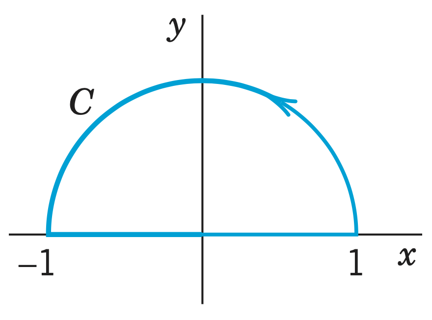
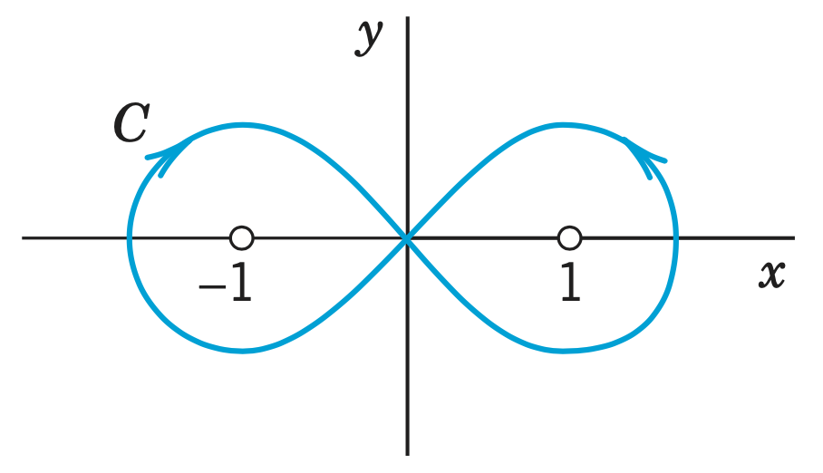

# Problem 14.2.9

Integrate $f(z)$ counterclockwise around the unit circle. Indicate whether Cauchy’s integral theorem applies. Show the details.

$$f(z) = \exp(-z^2)$$

## Solution

$f$ is entire since $f'$ is defined everywhere, therefore by Cauchy’s integral theorem

$$
\boxed{\oint_C f(z) \ dz = 0}
$$

# Problem 14.2.11

Integrate $f(z)$ counterclockwise around the unit circle. Indicate whether Cauchy’s integral theorem applies. Show the details.

$$f(z) = \frac{1}{2z-1}$$

## Solution

$f'$ is not defined at $z = \frac{1}{2}$ and therefore Cauchy’s integral theorem does not apply. By 14.2.(3), $\oint_C (z - z_0)^{-1} = 2 \pi i$. Therefore,

$$
\begin{aligned}
\oint_C f(z) \ dz &= \frac{1}{2} \oint_C \parens{z-\frac{1}{2}}^{-1} \ dz \\
&= \boxed{\pi i}
\end{aligned}
$$

# Problem 14.2.13

Integrate $f(z)$ counterclockwise around the unit circle. Indicate whether Cauchy’s integral theorem applies. Show the details.

$$f(z) = \frac{1}{z^4-1.1}$$

## Solution

$f'$ is not defined at $z = \sqrt[4]{1.1} \approx 1.02$, however this is outside the unit circle and therefore Cauchy’s integral theorem applies.

$$
\boxed{\oint_C f(z) \ dz = 0}
$$

# Problem 14.2.18

Integrate $f(z)$ counterclockwise around the unit circle. Indicate whether Cauchy’s integral theorem applies. Show the details.

$$f(z) = \frac{1}{4z-3}$$

## Solution

$f'$ is not defined at $z = \frac{3}{4}$ and therefore Cauchy’s integral theorem does not apply. By 14.2.(3), $\oint_C (z - z_0)^{-1} = 2 \pi i$. Therefore,

$$
\begin{aligned}
\oint_C f(z) \ dz &= \frac{1}{4} \oint_C \parens{z-\frac{3}{4}}^{-1} \ dz \\
&= \boxed{\frac{\pi i}{2}}
\end{aligned}
$$

# Problem 14.2.22

Evaluate the integral. Does Cauchy’s theorem apply? Show details.

$$\oint_C \Re z \ dz$$

{width=2in}

## Solution

$$f(z) = \Re z = u(x,y) + i v(x,y)$$

$$
\begin{aligned}
u &= x \\
u_x &= 1 \\
u_y &= 0
\end{aligned}
\quad
\begin{aligned}
v &= 0 \\
v_x &= 0 \\
v_y &= 0
\end{aligned}
$$

$u_x \neq v_y$ therefore $f$ is not analytic and Cauchy’s theorem does not apply.

$C_1: z = e^{it}, dz = ie^{it} \ dt, \ \Re z = \cos t, \quad t \in [0, \pi]$

$C_2: z = t, dz = dt, \ \Re z = t, \quad t \in [-1, 1]$

$$
\begin{aligned}
\oint_C f(z) \ dz 
&= \oint_C f(z(t)) \dot z(t) \ dt \\
&= \int_0^\pi \cos t ie^{it} \ dt 
    + \int_{-1}^{1} t \ dt \\
&= \int_0^\pi \cos t i(\cos t + i \sin t) \ dt 
    + \int_{-1}^{1} t \ dt \\
&= i\int_0^\pi \cos^2 t \ dt 
    - \int_0^\pi \cos t \sin t \ dt 
    + \int_{-1}^{1} t \ dt \\
&= \frac{i}{2} \int_0^\pi 1 + \cos 2t \ dt 
    - \frac{1}{2} \int_0^\pi \sin 2t \ dt 
    + \int_{-1}^{1} t \ dt \\
&= \frac{i}{2} \brackets{t + \frac{\sin 2t}{2}}_0^\pi 
    + \frac{1}{4} \brackets{\cos 2t}_0^\pi 
    + \frac{1}{2} \brackets{t^2}_{-1}^{1} \\
&= \frac{i}{2} \brackets{\pi}
    + \frac{1}{4} \brackets{0}
    + \frac{1}{2} \brackets{0} \\
&= \boxed{\frac{\pi i}{2}}
\end{aligned}
$$

# Problem 14.2.24

Evaluate the integral. Does Cauchy’s theorem apply? Show details. *(Use partial fraction)*

$$\oint_C \frac{dz}{z^2 - 1}$$

{width=2in}

## Solution

$$
\frac{1}{z^2 - 1} = \frac{A}{z-1} + \frac{B}{z+1}
\implies
1 = A (z+1) + B (z-1)
$$

$\begin{array}{ll}
z=-1: & B = -\frac{1}{2} \\
z=1: & A = \frac{1}{2}
\end{array}$

$$
\frac{1}{z^2 - 1} = \frac{1/2}{z-1} - \frac{1/2}{z+1}
$$

The integral becomes,

$$
\oint_C \frac{dz}{z^2 - 1} = \frac{1}{2} \oint_C \frac{1}{z - 1} - \frac{1}{z + 1} \ dz
$$

Splitting $C$ into $C_1$, the left half that circles $z=-1$ clockwise, and $C_2$, the right half that circles $z=1$ counterclockwise, we can evaluate each integral separately.

The first integral has a singularity at $z=1$, therefore over $C_1$ Cauchy's theorem holds and the integral is zero. Over $C_2$, Cauchy's theorem does not hold, but 14.2.(3) gives a solution of $\pi i$. 

$$
\frac{1}{2} \oint_C \frac{1}{z - 1} 
= \frac{1}{2} \brackets{\oint_{C_1} \frac{1}{z - 1} \ dz + \oint_{C_2} \frac{1}{z - 1} \ dz} 
= \frac{1}{2} \brackets{0 + 2 \pi i} 
= \pi i
$$

The second integral has a singularity at $z=-1$, therefore over $C_1$ Cauchy's theorem does not hold, but 14.2.(3) gives a solution of $-\pi i$ (due to the clockwise path). Over $C_2$, Cauchy's theorem holds and the integral is zero.

$$
\frac{1}{2} \oint_C \frac{1}{z + 1} 
= \frac{1}{2} \brackets{\oint_{C_1} \frac{1}{z + 1} \ dz + \oint_{C_2} \frac{1}{z + 1} \ dz} 
= \frac{1}{2} \brackets{0 - 2 \pi i} 
= -\pi i
$$

The final integral is

$$
\boxed{\oint_C \frac{dz}{z^2 - 1} = 2 \pi i}
$$

# Problem 14.3.3

Integrate by Cauchy's formula counterclockwise around the circle.

$$f(z) \frac{z^2}{z^2 - 1}, \qquad |z + i| = 1.4$$

## Solution

$f(z)$ has singularities at

$$
z^2 - 1 = 0
\implies
z_{1,2} = \pm 1
$$

$$
|z_{1,2} + i| = \sqrt{2} \approx 1.41 > 1.4
$$

Therefore the singularities are outside the domain and Cauchy's theorem holds.

$$
\boxed{\oint_C f(z) \ dz = 0}
$$

# Problem 14.3.11

Integrate counterclockwise.

$$
\oint_C \frac{dz}{z^2 + 4}, \quad C: 4x^2 + (y-2)^2 = 4
$$

## Solution

$f(z)$ has singularities at

$$
z^2 + 4 = 0
\implies
z_{1,2} = \pm 2i
$$

$z_1 = 2i$ is in the center of the region, however $z_2 = -2i$ lies outside. Therefore we can split the function in to the analytic and non-analytic factors and integrate via Cauchy's integral formula.

$$
\begin{aligned}
\oint_C \frac{dz}{z^2 + 4} 
&= \oint_C \frac{1}{(z - 2i)(z + 2i)} \ dz \\
&= \oint_C \frac{1/(z + 2i)}{(z - 2i)} \ dz \\
&= \frac{1}{(z + 2i)}\Big|_{z_0 = 2i} \cdot 2 \pi i \\
&= \frac{1}{4i} \cdot 2 \pi i \\
&= \boxed{\frac{\pi}{2}} \\
\end{aligned}
$$

# Problem 14.3.13

Integrate counterclockwise.

$$
\oint_C \frac{z + 2}{z - 2} \ dz, \quad C: |z - 1| = 2
$$

## Solution

$f(z)$ has a singularity at $z = 2$ which lies within the region. Integrate via Cauchy's integral formula.

$$
\begin{aligned}
\oint_C \frac{z + 2}{z - 2} \ dz
&= (z + 2)\Big|_{z_0 = 2} \cdot 2 \pi i \\
&= 4 \cdot 2 \pi i \\
&= \boxed{8 \pi i} \\
\end{aligned}
$$

# Problem 14.3.15 

Integrate counterclockwise. *(compute it for two squares: one with vertices $\pm 2, \pm 2i$; the other one with vertices $\pm 4, \pm 4i$)*

$$
\oint_C \frac{\cosh \parens{z^2 - \pi i}}{z - \pi i} \ dz, \quad C \text{ the boundary of the square with vertices } \pm 2, \pm 2, \pm 4i
$$

## Solution

# Problem 14.4.1

Integrate counterclockwise around the unit circle.

$$
\oint_C \frac{\sin z}{z^4} \ dz
$$

## Solution

# Problem 14.4.3

Integrate counterclockwise around the unit circle.

$$
\oint_C \frac{e^z}{z^n} \ dz, \quad n = 1, 2, \cdots
$$

## Solution

# Problem 14.4.6

Integrate counterclockwise around the unit circle.

$$
\oint_C \frac{dz}{(z - 2i)^2(z - i/2)^2}
$$

## Solution

# Problem 14.4.11

Integrate. Show the details. *Hint.* Begin by sketching the contour. Why?

$$
\oint_C \frac{(1 + z) \sin z}{(2z - 1)^2} \ dz, \quad C: |z - i| = 2 \text{ counterclockwise}
$$

## Solution
